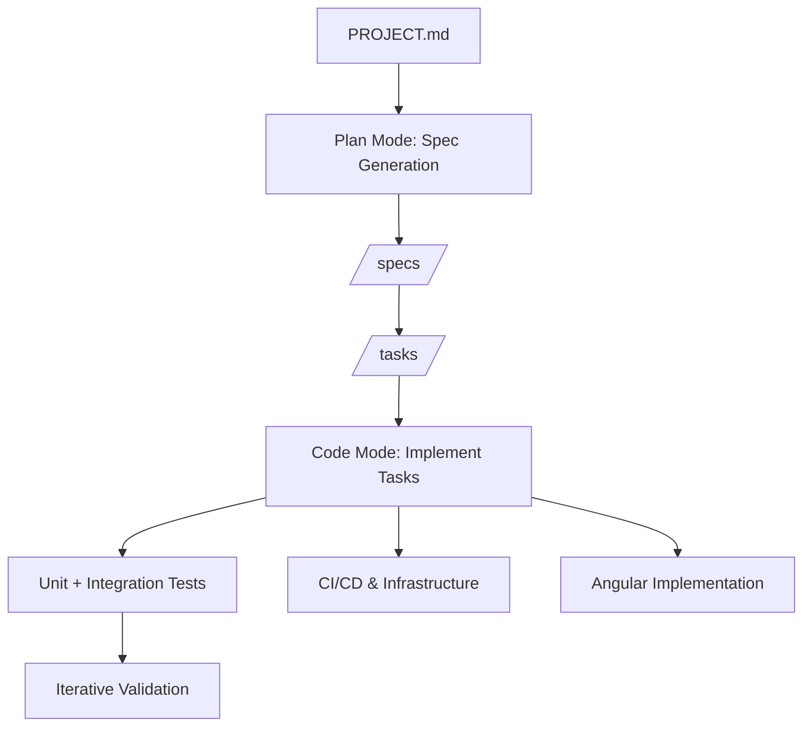

# AI Workflow for SaaS Project Implementation

This workflow is designed for use with Windsurf (or similar AI IDEs) to efficiently implement the Event-Driven SaaS Platform for Problem Tracking + Solution Validation. It covers both Plan Mode (spec generation, task breakdown) and Code Mode (task-based incremental implementation).

---

## 📚 Required Reading

**Before starting any work, read**: [BEST_PRACTICES.md](../BEST_PRACTICES.md)

This document provides:
- Efficient AI workflow patterns (60% faster context gathering)
- Documentation hierarchy and navigation
- Plan lifecycle management
- Prompt templates and examples
- Common workflows with step-by-step guidance

---

## 📋 Workflow Notes

### Documentation Guidelines

- **Plan Documents**: Create in `.windsurf/plans/active/` for implementation plans only. General documentation goes in `docs/` folder.
- **Minimize Duplication**: Reuse and update existing docs unless scope is vastly different (e.g., infrastructure planning, costs, CI/CD design).
- **Changelog**: Track PROJECT.md changes in `changelog/` directory with date-prefixed filenames.
- **Single Source of Truth**: Ensure consistency across all docs. Check `BEST_PRACTICES.md` for authoritative sources (AWS accounts, IAM roles, etc.).
- **Alignment Check**: Verify all changes align with PROJECT.md. If conflict exists, pause and ask how to proceed.

### Plan Lifecycle Management

**Automated Plan Management**:

1. **Creating Plans**:
   - Create in `.windsurf/plans/active/`
   - Include metadata: Created date, Status, Related Plans, Related Docs
   - Link to relevant specs and tasks

2. **During Implementation**:
   - Update plan status as work progresses
   - Document any deviations or issues
   - Keep related documentation in sync

3. **Completing Plans** (AUTOMATE THIS):
   ```bash
   # When plan implementation is complete:
   # 1. Update plan status to "Completed"
   # 2. Add completion date
   # 3. Move to appropriate completed subdirectory
   
   # Example:
   mv .windsurf/plans/active/feature-implementation.md \
      .windsurf/plans/completed/architecture/feature-implementation.md
   
   # Update plan metadata:
   # **Status**: Completed
   # **Completed**: YYYY-MM-DD
   ```

4. **Plan Organization**:
   - `active/` - Current work
   - `completed/infrastructure-restructure/` - Infrastructure plans
   - `completed/cicd/` - CI/CD plans
   - `completed/architecture/` - Architecture plans
   - `archived/` - Superseded plans

### Documentation Assessment Workflow

**Command**: `@[/project] assess the current workspace documentation`

**Process**:
1. Evaluate documentation quality (consistency, efficiency, depth, organization)
2. Create assessment in `docs/assessments/workspace-docs/YYYYMMDD_HHMMSS.assessment.md`
3. Ask if plan document should be created
4. If yes, create plan in `.windsurf/plans/assessments/workspace-docs/YYYYMMDD_HHMMSS.plan.md`
5. Link plan in assessment file

**No code changes during assessment** - only documentation evaluation.

### Documentation Update Automation

**When completing implementation**:

1. **Update Related Specs** (if architectural changes):
   - Add status metadata if missing
   - Update "Last Updated" date
   - Add cross-references to related docs

2. **Update Task Files**:
   - Mark tasks as completed
   - Add completion notes
   - Link to implementation

3. **Create/Update ADRs** (for architectural decisions):
   - Document in `docs/adr/ADR-XXX-title.md`
   - Follow ADR template in BEST_PRACTICES.md
   - Link from related specs

4. **Update DOCUMENTATION_INDEX.md** (if adding major docs):
   - Add to appropriate section
   - Update navigation tips if needed

5. **Create Changelog Entry** (if modifying PROJECT.md):
   - File: `changelog/YYYY-MM-DD-description.md`
   - Document what changed and why

### Consistency Verification

**Before completing any work, verify**:
- [ ] Changes align with PROJECT.md
- [ ] Related specs updated
- [ ] Related tasks updated
- [ ] Cross-references added
- [ ] Status metadata current
- [ ] Plan moved to completed/
- [ ] Changelog created (if needed)
- [ ] ADR created (if architectural change)

---

## 1. Project Foundation (Plan Mode)

**Goal:** Provide AI with authoritative project context.

* Input: `PROJECT.md`
* Prompt:

```
PROJECT.md is the authoritative system design for a production-grade SaaS platform.
Treat it as the ultimate specification. All plans, tasks, and code must respect its architecture, service boundaries, event-driven design, technology stack (Java Spring Boot, Angular, AWS), and DevOps principles.
```

> Ensures AI respects architecture, service boundaries, DDD, SOLID, and tech choices.

---

## 2. Generate `/specs` Folder (Plan Mode)

**Goal:** Break PROJECT.md into human- and AI-friendly specifications.

* Prompt:

```
Read PROJECT.md and generate a `/specs` folder structure containing:

- Architecture specs
- Microservice specs
- Infrastructure specs
- Frontend specs
- DevOps specs

For each file, provide a short description (3–6 bullet points) of its contents. Do NOT generate code. Maintain all architecture, service boundaries, and tech choices.
```

**Output Example:**

```
/specs
   architecture.md
   event-flow.md
   microservice-interactions.md
   aws-deployment.md
   ci-cd.md
   identity-service.md
   experiment-service.md
   metrics-service.md
   reporting-service.md
   notification-service.md
   angular-frontend.md
   infrastructure.md
   devops.md
   event-schemas.md
```

---

## 3. Generate Task Lists (Plan Mode)

**Goal:** Turn specs into incremental, actionable tasks.

* Prompt:

```
For each spec in `/specs`, generate a list of granular implementation tasks.
Each task should:
- Be small and implementable in a single coding session
- Specify domain model, API, events, or infrastructure piece
- Include associated tests if relevant
- Preserve all architecture and DDD boundaries
```

**Output Example:**

```
/tasks/experiment-service/
   001-create-domain-model.md
   002-create-repositories.md
   003-implement-API.md
   004-publish-events.md
   005-add-unit-tests.md
```

---

## 4. Task-Based Implementation (Code Mode)

**Goal:** Implement tasks incrementally.

* Prompt Template for Each Task:

```
Implement task <task-name> in the <service>.
Follow engineering principles in PROJECT.md:
- SOLID
- DDD
- Clean Architecture
- Spring Boot best practices (Java)

Generate only the code necessary for this task.

Include tests following the testing strategy (PROJECT.md Section 23a):
- Unit tests for domain logic and services (80%+ coverage)
- Integration tests for repositories and AWS integrations
- Use Testcontainers + LocalStack for integration tests
- Mock paid AWS services (EventBridge, CloudWatch) with @MockBean
- Use LocalStack for free-tier services (SQS, S3, DynamoDB)

Do NOT change other services or violate service boundaries.
Track progress using task checklists in the task files.
```

Subsequent prompts can follow this until all tasks are complete for the spec:
```
Continue onto the next task. If there are any parts that require manual intervention, pause execution until input is provided confirming the manual work is done.
```

> Repeat for all tasks across microservices, frontend, and infrastructure.

---

## 5. Parallel DevOps & Infrastructure (Code/Plan Mode)

* Implement CI/CD, AWS infrastructure, multi-env deployment tasks in parallel.
* Example Prompt:

```
Implement CI/CD pipeline job <job-name>.
Use GitHub Actions for builds, tests, SonarQube, Trivy, container builds, AWS deployments.
Ensure job is self-contained and respects environment boundaries (DEV/QA/PROD).
```

---

## 6. Frontend Implementation (Code Mode)

* Prompt Example:

```
Implement Angular frontend components for <feature>.
Follow architecture in PROJECT.md and angular-frontend.md spec.
Include service-based API calls, feature modules, and state management.
```

---

## 7. Observability & Monitoring (Code Mode)

* Implement logging, metrics, and distributed tracing incrementally.
* Use PROJECT.md and relevant specs as reference.

---

## 8. Iterative Validation

After each task or feature:

* Run unit tests and integration tests
  - Unit tests: `mvn test -Dtest="!*IntegrationTest"`
  - Integration tests: `mvn test -Dtest="*IntegrationTest"` (requires Docker)
  - Verify 80%+ code coverage with JaCoCo
* Validate CI/CD pipeline execution
  - Ensure all tests pass in GitHub Actions
  - Check test reports in PR checks
  - Verify coverage uploaded to Codecov
* Verify event-driven interactions
  - Integration tests should validate SQS message flow (LocalStack)
  - Mock EventBridge calls should be verified with @MockBean
  - Check event schemas match specifications

---

## 9. Efficiency Best Practices

**See [BEST_PRACTICES.md](../BEST_PRACTICES.md) for complete guidance.**

### Core Principles

1. **Documentation First**: Always check documentation before asking questions or making changes
2. **Plan Mode vs Code Mode**: Separate planning from implementation
3. **Single Source of Truth**: Treat PROJECT.md as authoritative, verify consistency
4. **Incremental Tasks**: Break work into small, testable units
5. **Follow Patterns**: Use existing patterns from specs, tasks, and completed plans
6. **Parallel Development**: DevOps and backend can progress simultaneously

### AI Workflow (3-Phase Pattern)

**Phase 1: Context Gathering** (60% faster with improved docs)
- Start with `DOCUMENTATION_INDEX.md` to locate relevant docs
- Read `PROJECT.md` for authoritative context
- Check related specs, tasks, and completed plans
- Verify ADRs for architectural decisions

**Phase 2: Verify Consistency**
- Does this align with PROJECT.md?
- Are there existing specs/tasks for this?
- What related docs need updating?
- Is there a completed plan with this pattern?

**Phase 3: Implementation**
- Follow existing patterns
- Update related documentation
- Create changelog entry if modifying PROJECT.md
- Move plan to completed/ when done

### Testing Best Practices

- Write unit tests first for TDD approach
- Use Testcontainers for integration tests (portable, reproducible)
- Apply hybrid AWS approach: LocalStack for free services, @MockBean for paid
- Verify tests pass locally before committing
- Aim for 80%+ code coverage across all services

### Documentation Updates

**After completing implementation**:
1. Update plan status to "Completed" and add completion date
2. Move plan from `active/` to `completed/<topic>/`
3. Update related specs with status metadata
4. Mark tasks as completed
5. Create ADR if architectural change
6. Create changelog entry if PROJECT.md modified
7. Update DOCUMENTATION_INDEX.md if adding major docs

---

## 10. Plan Completion Workflow

**When implementation is complete**, follow this checklist:

### Step 1: Update Plan Document

```markdown
# In the plan file, update metadata:
**Status**: Completed
**Completed**: YYYY-MM-DD
**Implementation Notes**: [Any deviations or important notes]
```

### Step 2: Move Plan to Completed Directory

```bash
# Determine appropriate subdirectory:
# - infrastructure-restructure/ - Infrastructure changes
# - cicd/ - CI/CD pipeline changes
# - architecture/ - Architectural changes
# - assessments/ - Documentation assessments

# Move plan:
mv .windsurf/plans/active/<plan-name>.md \
   .windsurf/plans/completed/<topic>/<plan-name>.md
```

### Step 3: Update Related Documentation

**If Specs Changed**:
```markdown
# Update spec file:
**Last Updated**: YYYY-MM-DD
**Status**: Current
**Related Documents**: [add cross-references]
```

**If Tasks Completed**:
```markdown
# In task file:
- [x] Task completed
**Completion Date**: YYYY-MM-DD
**Implementation**: See .windsurf/plans/completed/<topic>/<plan-name>.md
```

**If Architectural Decision**:
```bash
# Create ADR:
docs/adr/ADR-XXX-decision-title.md

# Follow template in BEST_PRACTICES.md
# Link from related specs
```

**If PROJECT.md Modified**:
```bash
# Create changelog entry:
changelog/YYYY-MM-DD-change-description.md

# Document what changed and why
```

### Step 4: Update Master Index (if needed)

```markdown
# If adding major documentation:
# Update DOCUMENTATION_INDEX.md with new links
```

### Step 5: Verify Consistency

**Final Checklist**:
- [ ] Plan status updated to "Completed"
- [ ] Plan moved to completed/<topic>/
- [ ] Related specs updated with status metadata
- [ ] Related tasks marked complete
- [ ] ADR created (if architectural change)
- [ ] Changelog created (if PROJECT.md changed)
- [ ] DOCUMENTATION_INDEX.md updated (if major docs added)
- [ ] All cross-references working
- [ ] No broken links

### Automation Example

```bash
# Example: Completing a CI/CD plan
cd .windsurf/plans

# 1. Update plan status (edit file)
# 2. Move to completed
mv active/cicd-improvement-plan.md completed/cicd/cicd-improvement-plan.md

# 3. Update related spec
# Edit specs/ci-cd-pipelines.md:
# **Last Updated**: 2026-03-25

# 4. Update related task
# Edit tasks/cicd/002-setup-cd-dev-pipeline.md:
# - [x] Task completed

# 5. Create ADR if needed
# Create docs/adr/ADR-009-cicd-improvement.md

# 6. Verify
grep -r "cicd-improvement-plan.md" . # Check for broken links
```

---

## 11. Suggested Build Order

1. Identity Service
2. Organization Service
3. Experiment Service
4. Metrics Service
5. BFF API (Backend for Frontend)
6. Event Infrastructure
7. Reporting Service
8. Notification Service
9. Angular Frontend (updated to use BFF API)
10. DevOps Infrastructure (including dual ALB setup)

> Prevents circular dependencies and ensures smooth incremental builds. BFF API must be built after microservices since it depends on them.

---

## 11. Workflow Diagram



---

## 12. Summary

This workflow allows AI IDEs to:

* Generate structured specs from the full project design
* Break each spec into incremental implementation tasks
* Implement tasks one-by-one in Code Mode
* Respect service boundaries, domain-driven design, and architecture
* Simultaneously implement DevOps, infrastructure, and frontend

Following this workflow provides a **principal-level engineering development process** for your portfolio SaaS project.

No additional specification should be needed once PROJECT.md is loaded.
