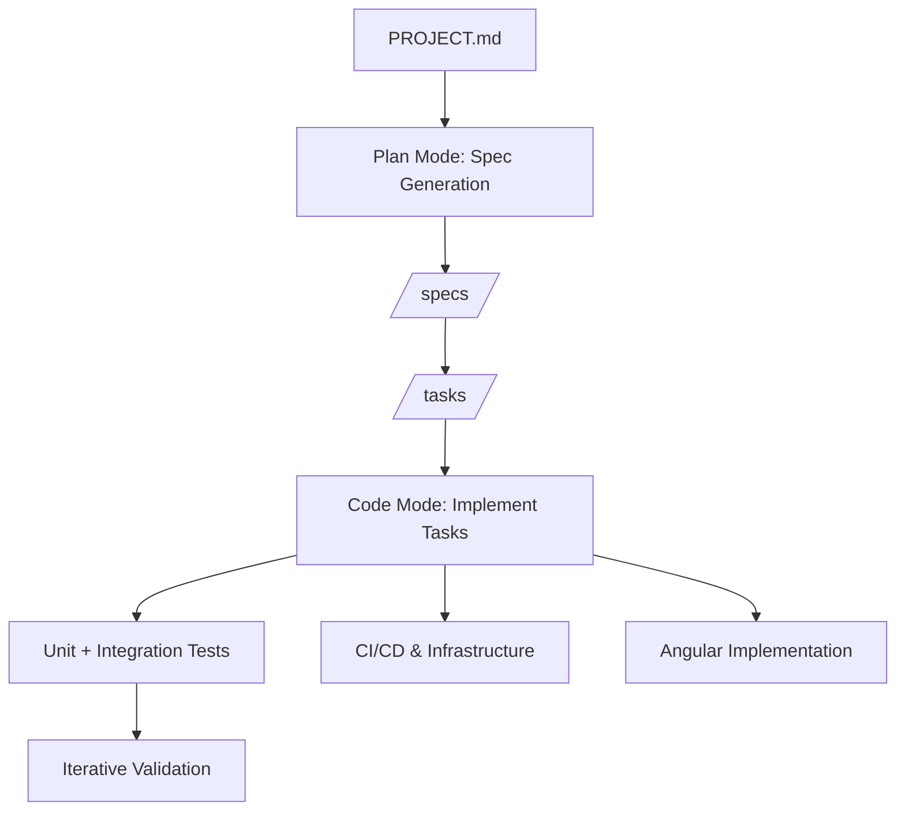

# AI Workflow for SaaS Project Implementation

This workflow is designed for use with Windsurf (or similar AI IDEs) to efficiently implement the Event-Driven SaaS Platform for Problem Tracking + Solution Validation. It covers both Plan Mode (spec generation, task breakdown) and Code Mode (task-based incremental implementation).


### Notes:

- All plan documents should be created in this local directory: `.windsurf/plans/`.
- There should be a `changelog/` directory for tracking changes to the project (PROJECT.md). In this directory, each file should be named with a date and a description of the changes made.

---

## 1. Project Foundation (Plan Mode)

**Goal:** Provide AI with authoritative project context.

* Input: `PROJECT.md`
* Prompt:

```
PROJECT.md is the authoritative system design for a production-grade SaaS platform.
Treat it as the ultimate specification. All plans, tasks, and code must respect its architecture, service boundaries, event-driven design, technology stack (Java Spring Boot, Angular, AWS), and DevOps principles.
```

> Ensures AI respects architecture, service boundaries, DDD, and tech choices.

---

## 2. Generate `/specs` Folder (Plan Mode)

**Goal:** Break PROJECT.md into human- and AI-friendly specifications.

* Prompt:

```
Read PROJECT.md and generate a `/specs` folder structure containing:

- Architecture specs
- Microservice specs
- Infrastructure specs
- Frontend specs
- DevOps specs

For each file, provide a short description (3–6 bullet points) of its contents. Do NOT generate code. Maintain all architecture, service boundaries, and tech choices.
```

**Output Example:**

```
/specs
   architecture.md
   event-flow.md
   microservice-interactions.md
   aws-deployment.md
   ci-cd.md
   identity-service.md
   experiment-service.md
   metrics-service.md
   reporting-service.md
   notification-service.md
   angular-frontend.md
   infrastructure.md
   devops.md
   event-schemas.md
```

---

## 3. Generate Task Lists (Plan Mode)

**Goal:** Turn specs into incremental, actionable tasks.

* Prompt:

```
For each spec in `/specs`, generate a list of granular implementation tasks.
Each task should:
- Be small and implementable in a single coding session
- Specify domain model, API, events, or infrastructure piece
- Include associated tests if relevant
- Preserve all architecture and DDD boundaries
```

**Output Example:**

```
/tasks/experiment-service/
   001-create-domain-model.md
   002-create-repositories.md
   003-implement-API.md
   004-publish-events.md
   005-add-unit-tests.md
```

---

## 4. Task-Based Implementation (Code Mode)

**Goal:** Implement tasks incrementally.

* Prompt Template for Each Task:

```
Implement task <task-name> in the <service>.
Follow engineering principles in PROJECT.md:
- SOLID
- DDD
- Clean Architecture
- Spring Boot best practices (Java)
Generate only the code necessary for this task.
Include unit tests where relevant.
Do NOT change other services or violate service boundaries.
```

> Repeat for all tasks across microservices, frontend, and infrastructure.

---

## 5. Parallel DevOps & Infrastructure (Code/Plan Mode)

* Implement CI/CD, AWS infrastructure, multi-env deployment tasks in parallel.
* Example Prompt:

```
Implement CI/CD pipeline job <job-name>.
Use GitHub Actions for builds, tests, SonarQube, Trivy, container builds, AWS deployments.
Ensure job is self-contained and respects environment boundaries (DEV/QA/PROD).
```

---

## 6. Frontend Implementation (Code Mode)

* Prompt Example:

```
Implement Angular frontend components for <feature>.
Follow architecture in PROJECT.md and angular-frontend.md spec.
Include service-based API calls, feature modules, and state management.
```

---

## 7. Observability & Monitoring (Code Mode)

* Implement logging, metrics, and distributed tracing incrementally.
* Use PROJECT.md and relevant specs as reference.

---

## 8. Iterative Validation

After each task or feature:

* Run unit tests and integration tests
* Validate CI/CD pipeline execution
* Verify event-driven interactions

---

## 9. Efficiency Best Practices

1. Always separate **Plan Mode** and **Code Mode**.
2. Treat PROJECT.md as the **single source of truth**.
3. Break tasks into small, incremental units.
4. Parallelize DevOps and backend development where possible.
5. Remind AI of service boundaries and architecture before coding.

---

## 10. Suggested Build Order

1. Identity Service
2. Organization Service
3. Experiment Service
4. Metrics Service
5. Event Infrastructure
6. Reporting Service
7. Notification Service
8. Angular Frontend
9. DevOps Infrastructure

> Prevents circular dependencies and ensures smooth incremental builds.

---

## 11. Workflow Diagram



---

## 12. Summary

This workflow allows AI IDEs to:

* Generate structured specs from the full project design
* Break each spec into incremental implementation tasks
* Implement tasks one-by-one in Code Mode
* Respect service boundaries, domain-driven design, and architecture
* Simultaneously implement DevOps, infrastructure, and frontend

Following this workflow provides a **principal-level engineering development process** for your portfolio SaaS project.

No additional specification should be needed once PROJECT.md is loaded.
