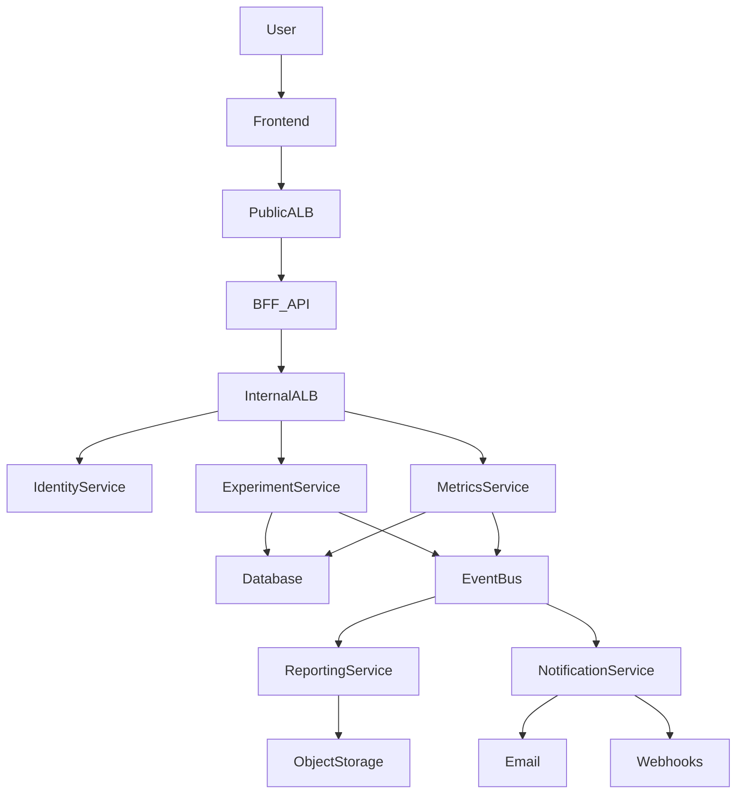
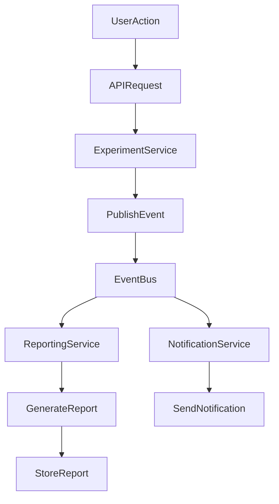
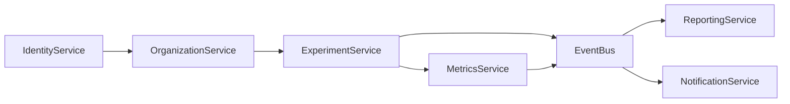
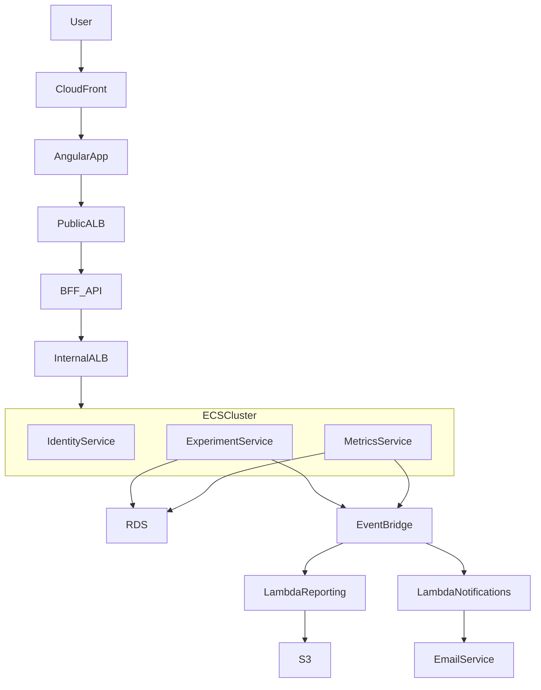
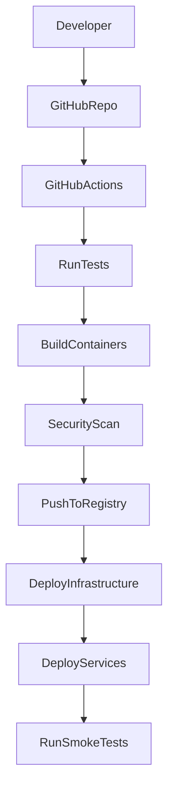

# Event-Driven SaaS Platform: Problem Tracking + Solution Validation

## 1. Overview

This project is a **production-style SaaS platform** designed to demonstrate principal-level software engineering, system design, and DevOps practices.

The platform enables teams, founders, and product builders to **identify problems, form hypotheses, run experiments, and validate solutions using measurable metrics**.

The system is intentionally designed as a **cloud-native, event-driven architecture** deployed on AWS with full CI/CD and infrastructure-as-code.

This repository is intended to serve as a **portfolio-quality engineering project** demonstrating:

- Principal-level software architecture
- Domain-driven design
- Event-driven systems
- Cloud-native infrastructure
- DevOps automation
- Production-level observability

---

# 2. AWS Account Architecture

This project utilizes a **multi-account AWS architecture** following AWS best practices for security, isolation, and cost management.

## AWS Organization Structure

**Organization ID**: `o-l3zk5a91yj`  
**Root Account**: `072456928432`  
**Management Account ARN**: `arn:aws:organizations::072456928432:root/o-l3zk5a91yj/r-gs6r`

## AWS Accounts

| Account Name | Account ID | Email | Purpose |
|--------------|------------|-------|---------|
| **root** | 072456928432 | aws@turafapp.com | Management account for AWS Organizations |
| **Ops** | 146072879609 | aws-ops@turafapp.com | DevOps tooling, CI/CD infrastructure, centralized logging |
| **dev** | 801651112319 | aws-dev@turafapp.com | Development environment for feature development |
| **qa** | 965932217544 | aws-qa@turafapp.com | QA/Staging environment for integration testing |
| **prod** | 811783768245 | aws-prod@turafapp.com | Production environment for live workloads |

## Account Isolation Strategy

**Security Boundaries**:
- Each environment runs in a separate AWS account
- Network isolation via separate VPCs per account
- IAM policies scoped to account boundaries
- Blast radius limitation for security incidents

**Cross-Account Access**:
- GitHub Actions OIDC roles per account
- Cross-account ECR image sharing (optional)
- Centralized logging aggregation in Ops account
- CloudTrail logs aggregated to root account

**Cost Management**:
- Cost allocation tags per account
- Separate billing for each environment
- Budget alerts configured per account
- Resource tagging enforced via SCPs

For detailed account information, see [AWS_ACCOUNTS.md](AWS_ACCOUNTS.md).

---

# 2a. Domain and DNS Architecture

## Purchased Domain

**Primary Domain**: `turafapp.com`

This domain is used for all production and non-production environments. All DNS names are subdomains of `turafapp.com`.

## DNS Naming Convention

### Environment-Specific Subdomains

All services use environment-specific subdomains following the pattern: `{service}.{env}.turafapp.com`

**Environments**:
- `dev` - Development environment
- `qa` - QA/Staging environment
- `prod` - Production environment (may omit `.prod` for brevity)

### DNS Records Structure

**Public-Facing Services**:
- `api.dev.turafapp.com` → Public ALB (BFF API) - Development
- `api.qa.turafapp.com` → Public ALB (BFF API) - QA
- `api.turafapp.com` → Public ALB (BFF API) - Production
- `app.dev.turafapp.com` → CloudFront (Angular Frontend) - Development
- `app.qa.turafapp.com` → CloudFront (Angular Frontend) - QA
- `app.turafapp.com` → CloudFront (Angular Frontend) - Production

**Internal Services** (Private Hosted Zone):
- `internal-alb.dev.turafapp.com` → Internal ALB - Development
- `internal-alb.qa.turafapp.com` → Internal ALB - QA
- `internal-alb.prod.turafapp.com` → Internal ALB - Production

**Service-Specific Internal Routes** (via Internal ALB path-based routing):
- `http://internal-alb.{env}.turafapp.com/identity/*` → Identity Service
- `http://internal-alb.{env}.turafapp.com/organization/*` → Organization Service
- `http://internal-alb.{env}.turafapp.com/experiment/*` → Experiment Service
- `http://internal-alb.{env}.turafapp.com/metrics/*` → Metrics Service

### SSL/TLS Certificates

**AWS Certificate Manager (ACM)**:
- Wildcard certificate: `*.turafapp.com` (covers all subdomains)
- Environment-specific wildcards: `*.dev.turafapp.com`, `*.qa.turafapp.com`, `*.prod.turafapp.com`

### Route53 Hosted Zones

**Public Hosted Zone**: `turafapp.com`
- Manages public DNS records for frontend and API
- A records point to CloudFront and ALB
- CNAME records for www redirect

**Private Hosted Zones** (per environment):
- `turafapp.com` (private, per VPC)
- Manages internal service discovery
- A records point to Internal ALB
- Only accessible within VPC

### Email Configuration

**AWS Account Emails**:
- Root: `aws@turafapp.com`
- Ops: `aws-ops@turafapp.com`
- Dev: `aws-dev@turafapp.com`
- QA: `aws-qa@turafapp.com`
- Prod: `aws-prod@turafapp.com`

**Application Emails** (Amazon SES):
- Notifications: `notifications@turafapp.com`
- Support: `support@turafapp.com`
- No-reply: `noreply@turafapp.com`

### DNS Management

**Registrar**: (To be specified)  
**DNS Provider**: Amazon Route 53  
**TTL Settings**:
- Production records: 300 seconds (5 minutes)
- Development records: 60 seconds (1 minute)

---

# 3. GitHub Repository

**Repository URL**: https://github.com/ryanwaite28/ai-projects-turaf  
**Repository Owner**: ryanwaite28  
**Repository Name**: ai-projects-turaf  
**Repository Type**: Monorepo

## Repository Structure

The project follows a monorepo architecture containing all services, infrastructure, and documentation:

```
ai-projects-turaf/
├── services/               # Backend microservices (Spring Boot)
├── frontend/               # Angular web application
├── infrastructure/         # Terraform infrastructure as code
├── libs/                   # Shared libraries and domain models (planned, not yet created)
├── .github/workflows/      # GitHub Actions CI/CD pipelines
├── docs/                   # Architecture documentation
├── specs/                  # Technical specifications
└── tasks/                  # Implementation task breakdown
```

## Branch Strategy

- **main** - Production-ready code, deploys to PROD account (811783768245)
- **develop** - Development branch, deploys to DEV account (801651112319)
- **release/*** - Release candidates, deploy to QA account (965932217544)
- **feature/*** - Feature development, CI validation only

## CI/CD Integration

All CI/CD pipelines use **GitHub Actions** with **AWS OIDC authentication** for secure, credential-free deployments to AWS accounts.

### GitHub Actions Workflows

**Infrastructure Workflows**:
- `infrastructure.yml` - Deploy shared infrastructure (VPC, ECS cluster, ALB, RDS, etc.)

**Service Workflows** (per service, per environment):
- `service-<name>-dev.yml` - Auto-deploy to DEV on `develop` branch
- `service-<name>-qa.yml` - Deploy to QA on `release/*` with manual approval
- `service-<name>-prod.yml` - Deploy to PROD on `main` with strict approval

**CI Workflows**:
- `ci.yml` - Run tests, linting, security scans on all branches
- `pr-checks.yml` - Validate pull requests

### Branch Protection Rules

**main branch**:
- Require pull request reviews (1 approval minimum)
- Require status checks to pass (CI tests, linting)
- Require branches to be up to date
- No force pushes
- No deletions

**develop branch**:
- Require status checks to pass
- Allow force pushes (for rebasing)

**release/* branches**:
- Require pull request reviews
- Require status checks to pass
- No force pushes

### AWS OIDC Authentication

GitHub Actions authenticate to AWS using OpenID Connect (OIDC) federation - no long-lived credentials stored in GitHub.

**OIDC Provider** (configured in each AWS account):
- Provider URL: `https://token.actions.githubusercontent.com`
- Audience: `sts.amazonaws.com`
- Thumbprint: GitHub's certificate thumbprint

**IAM Role per Account**:
- Role Name: `GitHubActionsDeploymentRole` (same name in all accounts)
- Trust Policy: Allows GitHub repository `ryanwaite28/ai-projects-turaf`
- Permissions: ECR, ECS, S3, CloudWatch, Terraform state access

**Workflow Authentication**:
```yaml
- name: Configure AWS credentials
  uses: aws-actions/configure-aws-credentials@v4
  with:
    role-to-assume: arn:aws:iam::${{ env.AWS_ACCOUNT_ID }}:role/GitHubActionsDeploymentRole
    aws-region: us-east-1
```

### Repository Security

**Secrets Management**:
- No AWS credentials stored in GitHub secrets
- Only non-sensitive configuration stored as secrets (SonarQube tokens, etc.)
- All sensitive data retrieved from AWS Secrets Manager at runtime

**Dependabot**:
- Automated dependency updates for Java, npm, Docker, GitHub Actions
- Security vulnerability scanning
- Auto-merge for patch updates

**Code Scanning**:
- CodeQL analysis on every push
- Trivy container scanning
- SonarQube code quality analysis

---

# 4. Project Objectives

The objective of this project is to build a **multi-tenant SaaS experimentation platform** that allows organizations to:

1. Define problems they want to solve
2. Create hypotheses
3. Run structured experiments
4. Record metrics
5. Generate validation reports

The system must support:

- multi-tenant organizations
- event-driven workflows
- asynchronous processing
- scalable cloud deployment
- CI/CD automation
- observability

---

# 5. Skills Demonstrated

This project demonstrates capabilities expected from **Senior / Staff / Principal Engineers**.

## Software Engineering

- SOLID design principles
- Clean Architecture
- Domain Driven Design (DDD)
- Testability and modular design
- Dependency inversion

## System Design

- Event-driven architecture
- Asynchronous workflows
- Domain events
- Bounded contexts
- Service boundaries

## Cloud Architecture

- AWS distributed systems
- event buses
- containerized services
- serverless processing
- scalable storage

## DevOps

- CI/CD pipelines
- Infrastructure as Code
- automated deployments
- container builds
- environment promotion

## Production Operations

- observability
- structured logging
- metrics and dashboards
- distributed tracing

---

# 5a. Product Concept

## Problem

Many teams attempt to build solutions without structured validation of the problems they are solving.

This leads to:

- wasted engineering time
- unvalidated features
- poor product-market fit

## Solution

A platform that enforces **structured experimentation**.

Users move through a workflow:

Problem -> Hypothesis -> Experiment -> Metrics -> Validation Report

This ensures product teams can make **data-driven decisions**.

---

# 57. Infrastructure Costs

## Cost Overview

The infrastructure is designed with **cost optimization for demo/portfolio purposes** while maintaining production-ready architecture patterns.

### Monthly Cost Breakdown (Development Environment)

| Service | Configuration | Monthly Cost |
|---------|--------------|--------------|
| **RDS PostgreSQL** | db.t3.micro, 20GB, Single-AZ | $0 (Free Tier) or $12 |
| **ECS Fargate** | 3 services, 0.25 vCPU, 512MB, Spot | $15 |
| **Application Load Balancer** | Single ALB, path-based routing | $16 |
| **VPC Endpoints** | ECR API, ECR DKR (2 endpoints) | $14 |
| **S3** | Single bucket, minimal storage | $2 |
| **ECR** | Container images, lifecycle policy | $1 |
| **Secrets Manager** | 5 secrets | $2 |
| **KMS** | 1 key | $1 |
| **Route 53** | Hosted zone | $0.50 |
| **CloudFront** | Frontend distribution | $1 |
| **CloudWatch Logs** | Log ingestion and storage | $2 |

**Total Monthly Cost**: ~$66.50/month (or ~$54.50 with Free Tier)

### Cost Optimization Strategies

**Services Disabled for Demo**:
- ❌ ElastiCache Redis: -$12/month (use in-memory cache or local Redis)
- ❌ DocumentDB: -$54/month (use PostgreSQL JSON columns)
- ❌ NAT Gateways: -$65/month (use VPC endpoints only)
- ❌ Multi-AZ RDS: -$12/month (Single-AZ sufficient for demo)
- ❌ Performance Insights: -$7/month (not needed for demo)

**Total Savings**: ~$150/month (69% reduction from production config)

### AWS Free Tier Utilization

**12-Month Free Tier**:
- RDS: 750 hours/month db.t3.micro (covers 24/7 usage)
- RDS Storage: 20 GB
- S3: 5 GB storage, 20,000 GET requests
- CloudFront: 1 TB data transfer out
- CloudWatch Logs: 5 GB ingestion

**Always Free**:
- VPC: Free
- Security Groups: Free
- Route 53 Queries: First 1 billion/month
- Lambda: 1M requests/month, 400,000 GB-seconds

### Production Environment Estimate

For production deployment with high availability:

| Service | Configuration | Monthly Cost |
|---------|--------------|--------------|
| **RDS PostgreSQL** | db.t3.small, Multi-AZ, 100GB | $72 |
| **ECS Fargate** | 6 services, 2 tasks each, 0.5 vCPU | $90 |
| **Application Load Balancer** | Single ALB | $16 |
| **NAT Gateways** | 2 AZs | $65 |
| **VPC Endpoints** | 6 endpoints | $43 |
| **ElastiCache Redis** | cache.t3.small, 2 nodes | $50 |
| **S3** | Multi-bucket, versioning | $10 |
| **ECR** | Container images | $3 |
| **Secrets Manager** | 10 secrets | $4 |
| **KMS** | 3 keys | $3 |
| **Route 53** | Hosted zone + queries | $2 |
| **CloudFront** | Frontend distribution | $5 |
| **CloudWatch** | Logs, metrics, alarms | $15 |

**Total Production Cost**: ~$378/month

### Cost Control Measures

1. **Resource Tagging**: All resources tagged with `Environment`, `Project`, `ManagedBy`
2. **Budget Alerts**: AWS Budgets configured per account
3. **Lifecycle Policies**: ECR and S3 cleanup policies
4. **Auto-Scaling**: ECS tasks scale down during low usage
5. **Spot Instances**: Fargate Spot for dev environment (70% savings)
6. **Single Database**: Multi-schema PostgreSQL vs. separate databases

### Estimated Annual Cost

- **Development**: ~$660/year (with Free Tier) or ~$798/year (after Free Tier)
- **Production**: ~$4,536/year

---

# 58. Changelog

## Problem Management

Users define problems including:

- problem description
- affected users
- context

## Hypothesis Tracking

Users create hypotheses linked to problems.

Example:

"If we implement X feature, user engagement will increase by 20%."

## Experiment Execution

Experiments allow teams to test hypotheses.

Experiments track:

- start date
- end date
- metrics
- outcome

## Metrics Collection

Experiments record quantitative metrics.

Example metrics:

- conversion rate
- user engagement
- signup rate

## Report Generation

After experiment completion the system generates:

- validation summary
- metrics analysis
- outcome classification

Reports are stored for future reference.

## Communications

Real-time messaging for team collaboration.

Features:

- Direct messaging (1-on-1 conversations)
- Group chat conversations
- Unread message indicators
- Typing indicators
- Message history and persistence

---

# 6. Domain Model (DDD)

## Core Entities

Organization
User
Problem
Hypothesis
Experiment
Metric
ExperimentResult
Report
Conversation
Message
Participant
ReadState

## Entity Relationships

Organization
  -> Users
  -> Problems

Problem
  -> Hypotheses

Hypothesis
  -> Experiments

Experiment
  -> Metrics
  -> Results

---

# 7. Domain Events

The system is designed as an **event-driven architecture**.

## Key Events

ProblemCreated
HypothesisCreated
ExperimentStarted
MetricRecorded
ExperimentCompleted
ReportGenerated
MessageDelivered

These events allow services to react asynchronously.

Example:

ExperimentCompleted
  -> triggers report generation

---

# 8. Event Driven Architecture

High level event flow:

User Action
  -> API Service
  -> Domain Event
  -> Event Bus
  -> Event Consumers

Example pipeline:

ExperimentCompleted
  -> Event Bus
  -> Report Generator
  -> Report Stored
  -> Notification Sent

---

# 9. System Architecture

High-level architecture components:

Frontend (Angular)

API Layer

Core API Service

Event Bus

Async Processing Services

Persistent Storage

Object Storage

---

# 10. AWS Infrastructure

The platform will run entirely on AWS.

Compute

ECS services
Lambda processors

Messaging

Event bus
Queue processing

Storage

Relational database
Object storage

Networking

VPC
Security Groups
Application Load Balancers (Public + Internal)

---

# 10a. Network Architecture

The system uses a **dual Application Load Balancer (ALB)** architecture to provide secure, scalable routing between the frontend, BFF API, and microservices.

## Application Load Balancers

### Public ALB (Internet-Facing)

**Purpose**: Routes frontend traffic to BFF API

**Configuration**:
- Name: `turaf-public-alb-{env}`
- Scheme: internet-facing
- Subnets: Public subnets in 2 availability zones
- Security Group: Allow HTTPS (443) from internet, HTTP (80) for redirect

**Listeners**:
- Port 443 (HTTPS): SSL termination with ACM certificate, forward to BFF API
- Port 80 (HTTP): Redirect to HTTPS

**DNS**: `api.{env}.turafapp.com` (Route53 A record → Public ALB)

**Target Group**: BFF API ECS tasks (health check: `/actuator/health`)

### Internal ALB (Private)

**Purpose**: Routes BFF API traffic to microservices

**Configuration**:
- Name: `turaf-internal-alb-{env}`
- Scheme: internal
- Subnets: Private subnets in 2 availability zones
- Security Group: Allow HTTP (80) from BFF API security group only

**Path-Based Routing**:
- `/identity/*` → Identity Service target group
- `/organization/*` → Organization Service target group
- `/experiment/*` → Experiment Service target group
- `/metrics/*` → Metrics Service target group
- `/communications/*` → Communications Service target group
- `/ws/*` → WebSocket Gateway target group (WebSocket upgrade support)

**DNS**: `internal-alb.{env}.turafapp.com` (Route53 private hosted zone)

**Target Groups**: One per microservice (health check: `/actuator/health`)

## Traffic Flow

```
Internet
  ↓
CloudFront (Static Assets: Angular SPA)
  ↓
Public ALB (HTTPS - api.turafapp.com)
  ↓
BFF API (Spring Boot REST - ECS Fargate)
  ↓
Internal ALB (HTTP - internal-alb.turafapp.com)
  ↓
Microservices (ECS Fargate)
  ├── Identity Service
  ├── Organization Service
  ├── Experiment Service
  └── Metrics Service
```

## Security Model

**Defense in Depth**:
1. CloudFront → Public ALB: HTTPS only, WAF rules
2. Public ALB → BFF API: Security group restricts to ALB only
3. BFF API → Internal ALB: Security group restricts to BFF only
4. Internal ALB → Services: Security group restricts to ALB only
5. Services → RDS: Security group restricts to service tasks only

**Network Segmentation**:
- Public subnets: Public ALB only
- Private subnets: BFF API, Internal ALB, microservices, RDS
- No direct internet access for services (NAT Gateway for outbound)

---

# 11. Service Boundaries

Logical service domains:

Identity Service
Organization Service
Experiment Service
Metrics Service
Reporting Service
Notification Service
Communications Service
WebSocket Gateway

Each service publishes and consumes domain events.

---

# 12. Clean Architecture Structure

Example code layout:

src/

 domain/

 application/

 infrastructure/

 interfaces/

The domain layer contains:

- entities
- value objects
- domain events

The application layer contains:

- use cases
- services

The infrastructure layer contains:

- database repositories
- messaging adapters

The interface layer contains:

- REST APIs
- GraphQL APIs

---

# 13. Observability

The platform must support full production observability.

## Logging

Structured JSON logs.

## Metrics

Track operational metrics such as:

- experiments started
- experiments completed
- event processing latency

## Tracing

Distributed tracing across services.

---

# 14. DevOps Pipeline

Continuous integration and deployment pipeline.

Stages:

1. Lint
2. Unit Tests
3. Build Containers
4. Security Scan
5. Push Images
6. Deploy Infrastructure
7. Deploy Services

---

# 15. Infrastructure as Code

All cloud resources must be provisioned using Infrastructure as Code.

Resources include:

- compute services
- networking
- storage
- event infrastructure
- permissions

---

# 16. Repository Structure

Root repository structure:

services/

infrastructure/

libs/                        (planned, not yet created)

.github/workflows/

docs/

Docs folder includes:

architecture documentation
architecture decision records
diagrams

---

# 17. Architecture Decision Records

This section documents key architectural decisions made during the platform's development.

---

## ADR-006: Single Database Multi-Schema Architecture

**Status**: Accepted  
**Date**: 2026-03-19

### Context

The Turaf platform is designed as a microservices architecture with core services (Identity, Organization, Experiment, Metrics, Communications). The initial vision called for separate database instances per service to maintain strict service boundaries.

However, as an early-stage platform, we face practical considerations:
- **Infrastructure Complexity**: Managing multiple RDS instances increases operational overhead
- **Cost Efficiency**: Multiple database instances significantly increase AWS costs
- **Development Experience**: Local development requires managing multiple database containers
- **Deployment Complexity**: Database migrations, backups, and monitoring multiply across instances

### Decision

Implement a **single PostgreSQL database with schema-based isolation per service**.

**Database Structure**:
- Single RDS PostgreSQL instance per environment (`turaf-db-{env}`)
- Isolated schemas per service:
  - `identity_schema` - User authentication and authorization
  - `organization_schema` - Organization and membership management
  - `experiment_schema` - Problems, hypotheses, and experiments
  - `metrics_schema` - Metrics and aggregations
  - `communications_schema` - Conversations, messages, and participants

**Access Control**:
- One database user per service with schema-scoped permissions
- No cross-schema foreign keys or references
- Database-level permission enforcement prevents cross-schema access

**Migration Management**:
- Centralized Flyway service manages all schema migrations
- Each migration targets specific schema via `SET search_path`
- Independent migration version control per service

### Consequences

**Positive**:
- ~75% reduction in database costs compared to separate instances
- Single PostgreSQL container for local development
- Simplified disaster recovery procedures
- Schema isolation enforces service boundaries
- Clear migration path to separate databases when needed

**Negative**:
- Shared resource contention (CPU, memory, I/O)
- Single point of failure
- **Mitigations**: Connection pooling limits, Multi-AZ deployment, automated failover

---

## ADR-007: Infrastructure Restructure - Service-Managed Resources

**Status**: Accepted  
**Date**: 2026-03-25

### Context

The initial infrastructure design managed all resources (shared + service-specific) in a centralized Terraform configuration. This created:
- **Tight Coupling**: All services deployed together
- **Slow Iteration**: Infrastructure changes required full Terraform apply
- **Ownership Ambiguity**: Unclear resource ownership
- **Deployment Bottleneck**: Infrastructure team blocked service deployments
- **Risk Amplification**: Changes to one service could affect all services

### Decision

**Split infrastructure management** into two layers:

**Layer 1: Shared Infrastructure (Platform Team - Terraform)**:
- Networking: VPC, subnets, NAT gateways, security groups
- Compute: ECS Cluster, Application Load Balancer
- Data: RDS PostgreSQL, S3 buckets
- Messaging: EventBridge, SQS queues
- IAM: Execution roles, task roles, OIDC providers

**Layer 2: Service-Specific Resources (Service Teams - CI/CD)**:
- ECS Task Definition: Container configuration, environment variables
- ECS Service: Desired count, deployment configuration
- ALB Target Group: Health checks, deregistration delay
- ALB Listener Rule: Path-based routing, priority
- CloudWatch Log Group: Service-specific logs

**Deployment Flow**:
1. Platform team deploys shared infrastructure via `infrastructure.yml` workflow
2. Service teams deploy their services via `service-<name>-<env>.yml` workflows
3. Service Terraform references shared infrastructure via `terraform_remote_state`
4. Each service has independent Terraform state in S3

### Consequences

**Positive**:
- Services deploy independently without coordination
- Faster iteration cycles for service development
- Clear ownership and accountability
- Separate Terraform state prevents conflicts
- Shared ALB and ECS cluster reduce costs

**Negative**:
- More complex Terraform structure
- Requires coordination on shared resource changes
- **Mitigations**: Clear documentation, automated testing, change review process

---

## ADR-008: Hybrid CI/CD Deployment Pattern

**Status**: Accepted  
**Date**: 2026-03-25

### Context

Following the infrastructure restructure (ADR-007), we needed to define how services deploy their infrastructure via CI/CD pipelines.

### Decision

Implement a **hybrid CI/CD deployment pattern**:

**Shared Infrastructure Deployment**:
- Tool: Terraform
- Location: `infrastructure/terraform/`
- Workflow: `infrastructure.yml`
- Trigger: Changes to infrastructure code, manual dispatch
- Responsibility: Platform team

**Service-Specific Deployment**:
- Tool: Terraform (infrastructure) + Docker (images)
- Location: `services/<service>/terraform/`
- Workflow: `service-<name>-<env>.yml` (one per service per environment)
- Trigger: Changes to service code, path-filtered
- Responsibility: Service teams

**Workflow Pattern (Per Service, Per Environment)**:
- `service-identity-dev.yml` - Auto-deploy on `develop` branch
- `service-identity-qa.yml` - Manual approval on `release/*` branch
- `service-identity-prod.yml` - Strict approval on `main` branch

**Deployment Jobs (3-stage)**:
1. **build-and-push**: Build Docker image, push to ECR, security scan
2. **deploy-service**: Run Terraform to deploy/update service infrastructure
3. **verify-deployment**: Wait for ECS stability, run health checks

### Rationale

**Why Terraform for Service Deployment?**
- Manages complete infrastructure lifecycle (create, update, delete)
- Declarative approach prevents drift
- State tracking ensures idempotency
- Team already familiar with Terraform

**Why Per-Service Workflows?**
- Services deploy without affecting others
- Path filtering only triggers when service code changes
- Clear ownership per service team
- Different approval rules per environment

**Why 3-Stage Deployment?**
- Stage 1: Builds image, runs security scan, fails fast
- Stage 2: Deploys infrastructure, requires approval for QA/PROD
- Stage 3: Verifies deployment health, enables rollback

### Consequences

**Positive**:
- Independent service deployments
- Clear separation of concerns
- Automated testing at each stage
- Easy to add new services

**Negative**:
- More GitHub Actions workflows to maintain
- Requires understanding of Terraform
- **Mitigations**: Template workflows, comprehensive documentation

---

# 18. Advanced Features

To demonstrate principal-level design the system should include:

Multi-tenant architecture

Event-driven workflows

Async processing

Automated reporting

External integrations

Webhook support

Notification system

---

# 19. Development Phases

## Phase 1

Domain model
API service
Basic experiment workflow

## Phase 2

Event system
Async processors
Reporting

## Phase 3

Cloud deployment
Infrastructure as Code

## Phase 4

Observability
Monitoring

## Phase 5

Documentation
Architecture diagrams

---

# 20. Success Criteria

The project will be considered complete when:

- full experiment lifecycle works
- events trigger async workflows
- infrastructure deploys automatically
- CI/CD pipeline functions
- observability is implemented
- architecture documentation is complete

---

# 21. Long-Term Extensions

Future enhancements could include:

analytics dashboards
A/B testing support
AI-assisted experiment analysis
advanced metrics pipelines

---

# 22. Goal of the Repository

This repository serves as a **portfolio-grade demonstration of principal-level engineering**.

It demonstrates the ability to:

- design distributed systems
- build scalable SaaS platforms
- operate production cloud infrastructure
- implement DevOps automation

The project should be treated as if it were a **real production startup system**.


---

# 23. Engineering Principles

The system must follow well established engineering principles used in large production systems.

## SOLID

All services and modules should follow SOLID principles:

Single Responsibility Principle

Each class or module should have only one responsibility.

Open Closed Principle

Modules should be open for extension but closed for modification.

Liskov Substitution Principle

Interfaces must be substitutable without breaking behavior.

Interface Segregation Principle

Prefer multiple smaller interfaces rather than one large interface.

Dependency Inversion Principle

High level modules should depend on abstractions rather than implementations.

---

## Domain Driven Design

The system should model the real domain using DDD principles.

Important concepts:

Entities
Value Objects
Aggregates
Domain Events
Repositories
Application Services

The domain layer must not depend on infrastructure concerns.

---

## Clean Architecture

The architecture must enforce strict separation between layers.

Dependency direction:

interfaces -> application -> domain

Infrastructure depends on domain but domain never depends on infrastructure.

---

## Testing Philosophy

Testing strategy must include multiple levels:

Unit Tests

Test domain logic in isolation.

Integration Tests

Validate database and messaging integrations.

End-to-End Tests

Verify full experiment workflows.

---

# 22a. Local Development Setup

Complete guide for running the Turaf platform locally using Docker Compose.

## Prerequisites

### Required Software

- **Docker Desktop** 4.0+ with Docker Compose 2.0+
- **Java JDK** 17+
- **Maven** 3.8+
- **Git** 2.30+

### Optional Tools

- **AWS CLI** 2.0+ for MiniStack interaction
- **PostgreSQL Client** (psql) for direct database access
- **IntelliJ IDEA** or **VS Code** for development

### System Requirements

- **RAM**: 8GB minimum, 16GB recommended
- **Disk Space**: 10GB free space
- **OS**: macOS, Linux, or Windows with WSL2

## Quick Start

### 1. Clone Repository

```bash
git clone https://github.com/ryanwaite28/ai-projects-turaf.git
cd ai-projects-turaf
```

### 2. Setup Environment

```bash
# Copy environment template
cp .env.example .env

# Edit .env with your preferences (optional for local dev)
nano .env
```

### 3. Start All Services

**Option A: Run Everything in Docker (Recommended)**

```bash
# Build and start all services (first time)
docker-compose up --build

# Or start in detached mode
docker-compose up -d --build

# Verify all services are running
docker-compose ps

# Check logs for all services
docker-compose logs -f

# Check specific service logs
docker-compose logs -f bff-api
docker-compose logs -f identity-service
```

**Option B: Run Infrastructure Only (Hybrid Development)**

```bash
# Start only database and MiniStack
docker-compose up -d postgres ministack

# Run services locally via Maven
cd services/identity-service
mvn spring-boot:run -Dspring-boot.run.profiles=local
```

### 4. Verify Services

```bash
# Check BFF API
curl http://localhost:8080/actuator/health

# Check Identity Service
curl http://localhost:8081/actuator/health

# Check Organization Service
curl http://localhost:8082/actuator/health

# Check Experiment Service
curl http://localhost:8083/actuator/health

# Check Metrics Service
curl http://localhost:8084/actuator/health
```

### 5. Access Frontend

Open browser to: `http://localhost:4200`

## Docker Compose Configuration

The platform uses Docker Compose to orchestrate all services locally:

**Services**:
- `postgres` - PostgreSQL 15.3 database (port 5432)
- `ministack` - AWS service emulator (port 4566)
- `bff-api` - Backend for Frontend (port 8080)
- `identity-service` - Authentication service (port 8081)
- `organization-service` - Organization management (port 8082)
- `experiment-service` - Experiment management (port 8083)
- `metrics-service` - Metrics collection (port 8084)
- `communications-service` - Messaging service (port 8085)
- `ws-gateway` - WebSocket gateway (port 8086)
- `frontend` - Angular application (port 4200)

**Networking**:
- All services connected via `turaf-network` bridge network
- Services communicate using service names as hostnames
- Frontend proxies API requests to BFF API

## Database Management

### Local Database Setup

The PostgreSQL database is automatically initialized with all schemas:

**Database**: `turaf`
**Schemas**:
- `identity_schema` - User authentication
- `organization_schema` - Organizations
- `experiment_schema` - Experiments
- `metrics_schema` - Metrics
- `communications_schema` - Messages

**Users**:
- `identity_user` → `identity_schema`
- `organization_user` → `organization_schema`
- `experiment_user` → `experiment_schema`
- `metrics_user` → `metrics_schema`
- `communications_user` → `communications_schema`

### Running Migrations

Migrations run automatically on service startup via Flyway:

```bash
# Manual migration execution
cd services/flyway-service
./scripts/run-migrations.sh
```

### Database Access

```bash
# Connect to database
docker exec -it turaf-postgres psql -U postgres -d turaf

# List schemas
\dn

# Switch to schema
SET search_path TO identity_schema;

# List tables
\dt
```

## MiniStack (AWS Services)

MiniStack provides local AWS service emulation for development and testing.

**Emulated Services**:
- **SQS** - Message queuing
- **S3** - Object storage
- **DynamoDB** - NoSQL database
- **SES** - Email service
- **Lambda** - Serverless functions
- **SNS** - Pub/sub messaging
- **EventBridge** - Event bus
- **Secrets Manager** - Secret storage

**Endpoint**: `http://localhost:4566`

**AWS CLI Configuration**:
```bash
# Configure AWS CLI for MiniStack
aws configure --profile ministack
# AWS Access Key ID: test
# AWS Secret Access Key: test
# Default region: us-east-1

# Use MiniStack endpoint
aws --endpoint-url=http://localhost:4566 --profile ministack s3 ls
```

## Troubleshooting

### Services Won't Start

**Problem**: Docker containers fail to start

**Solutions**:
1. Check Docker is running: `docker ps`
2. Check port conflicts: `lsof -i :8080` (check all service ports)
3. Clear Docker cache: `docker-compose down -v && docker system prune -f`
4. Rebuild images: `docker-compose build --no-cache`

### Database Connection Errors

**Problem**: Services can't connect to PostgreSQL

**Solutions**:
1. Verify database is running: `docker-compose ps postgres`
2. Check database logs: `docker-compose logs postgres`
3. Verify connection string in `.env` file
4. Restart database: `docker-compose restart postgres`

### Migration Failures

**Problem**: Flyway migrations fail

**Solutions**:
1. Check migration files in `services/flyway-service/migrations/`
2. Verify migration naming: `V{NNN}__{service}_{description}.sql`
3. Check Flyway history: `SELECT * FROM flyway_schema_history;`
4. Repair Flyway: `flyway repair` (if needed)

### Port Already in Use

**Problem**: Port conflict prevents service startup

**Solutions**:
```bash
# Find process using port
lsof -i :8080

# Kill process
kill -9 <PID>

# Or change port in docker-compose.yml
```

### Out of Memory

**Problem**: Docker runs out of memory

**Solutions**:
1. Increase Docker memory limit in Docker Desktop settings (8GB recommended)
2. Stop unused containers: `docker stop $(docker ps -q)`
3. Reduce service count: Run only needed services

## Development Workflows

### Making Code Changes

```bash
# 1. Make changes to service code
# 2. Rebuild specific service
docker-compose build identity-service

# 3. Restart service
docker-compose restart identity-service

# 4. Watch logs
docker-compose logs -f identity-service
```

### Running Tests

```bash
# Unit tests only
mvn test -Dtest="!*IntegrationTest"

# Integration tests (Docker required)
mvn test -Dtest="*IntegrationTest"

# All tests
mvn test
```

### Stopping Services

```bash
# Stop all services
docker-compose down

# Stop and remove volumes (clean slate)
docker-compose down -v

# Stop specific service
docker-compose stop identity-service
```

---

# 23a. Testing Strategy

The platform implements a comprehensive testing strategy using modern testing tools and practices to ensure code quality and reliability across all environments.

## Testing Pyramid

The testing approach follows the testing pyramid principle:

**Unit Tests (Base)** - 70% of tests

Fast, isolated tests of domain logic, services, and utilities.

**Integration Tests (Middle)** - 25% of tests

Tests validating interactions between components, databases, and AWS services.

**End-to-End Tests (Top)** - 5% of tests

Full workflow tests through the UI and APIs.

---

## Integration Testing with Testcontainers

Integration tests use **Testcontainers** to provide isolated, reproducible test environments.

### Key Benefits

**Portability**: Same tests run locally and in CI/CD pipelines.

**Isolation**: Each test run gets fresh containers.

**Automatic Lifecycle**: Containers start/stop with test execution.

**No Manual Setup**: No need to install or configure services locally.

---

## AWS Service Testing Strategy (Hybrid Approach)

The platform uses a **hybrid approach** to balance test coverage with infrastructure costs:

### MiniStack for Local AWS Emulation

Use [MiniStack](https://github.com/Nahuel990/ministack) (`nahuelnucera/ministack`) as a free, open-source AWS emulator for local development and integration tests. MiniStack is a drop-in replacement for LocalStack with all services free, ~150MB image footprint, and MIT licensed.

Emulated services used by this project:

- **SQS** (Simple Queue Service) - Message queuing
- **S3** (Object Storage) - File storage
- **DynamoDB** (NoSQL Database) - Key-value storage and idempotency tracking
- **SES** (Simple Email Service) - Email notifications
- **Lambda** (Serverless Functions) - Function execution
- **SNS** (Simple Notification Service) - Pub/sub messaging
- **EventBridge** (Event Bus) - Event routing and rules
- **Secrets Manager** - Secret storage

### Mocks for Unsupported Services

Use Spring `@MockBean` for AWS services not emulated by MiniStack:

- **CloudWatch Logs/Metrics** - Observability
- **Step Functions** - Workflow orchestration
- **AppSync** - GraphQL API

This approach provides:

- **Zero AWS costs** for integration tests
- **Realistic testing** for core messaging, storage, and event-driven workflows
- **Full EventBridge testing** locally without mocks
- **Fast execution** in CI/CD pipelines

---

## Test Execution in CI/CD Pipeline

Integration tests run at specific stages in the CI/CD pipeline:

### CI Pipeline (All Branches)

1. **Lint** - Code quality checks
2. **Unit Tests** - Fast domain and service tests
3. **Build** - Compile and package
4. **Integration Tests** - Testcontainers + MiniStack tests
5. **Security Scan** - Vulnerability scanning

### CD Pipeline (Environment-Specific)

**DEV Environment**:
- Integration tests run after deployment
- Smoke tests validate service health

**QA Environment**:
- Full integration test suite
- End-to-end tests via Playwright
- Manual approval gate

**PROD Environment**:
- Smoke tests only
- Blue-green deployment validation
- Rollback capability

---

## Local Development Testing

Developers can run integration tests locally with zero setup:

```bash
# Run unit tests only
mvn test -Dtest="!*IntegrationTest"

# Run integration tests (Docker required)
mvn test -Dtest="*IntegrationTest"

# Run all tests
mvn test
```

Docker Desktop or Docker Engine must be running for integration tests.

---

## Test Coverage Expectations

**Minimum Coverage Requirements**:

- **Domain Layer**: 90%+ coverage
- **Application Services**: 85%+ coverage
- **Infrastructure**: 70%+ coverage
- **Overall Project**: 80%+ coverage

Coverage reports generated by JaCoCo and published to Codecov.

---

# 23b. Architecture Testing Strategy

The platform implements **architecture tests** to validate the complete system integration from entry points through all event-driven processes. Architecture tests complement the existing testing pyramid by testing the full system as a whole.

## Overview

Architecture testing validates end-to-end workflows by testing from the BFF API and WebSocket Gateway entry points through all downstream microservices, event-driven processes (EventBridge, SQS, Lambdas), and data persistence.

**Key Characteristics**:
- Test complete user workflows from API entry points
- Validate event-driven processes with proper waiting strategies
- Run against fully deployed systems (local Docker Compose or AWS environments)
- Independent execution that does not block service deployments
- Automated test report generation and publishing

## Testing Framework

**Karate Framework**: API testing framework with native support for HTTP, WebSocket, and async workflows.

**Benefits**:
- Gherkin-based feature files for readable test scenarios
- Built-in support for REST APIs and WebSocket testing
- Java integration for custom helpers and waiting strategies
- Parallel test execution
- Rich HTML reporting

## Test Scope

### Authentication & Authorization Flows
- User registration → token generation → profile access
- Login → JWT validation → protected resource access
- Token refresh and logout workflows

### Organization Management
- Create organization → verify persistence → list organizations
- Add members → EventBridge notification → member receives invite
- Update organization → verify changes → audit log created

### Experiment Lifecycle (Event-Driven)
- Create problem → ProblemCreated event → notification sent
- Create hypothesis → linked to problem
- Start experiment → ExperimentStarted event → metrics collection enabled
- Record metrics → MetricRecorded events → aggregation processing
- Complete experiment → ExperimentCompleted event → report generation triggered
- Wait for async report generation (Lambda) → verify report in S3
- Retrieve report → verify content and metrics

### Real-Time Communication (WebSocket)
- Connect to WebSocket Gateway → authenticate → join conversation
- Send message → EventBridge routing → SQS delivery → recipient receives
- Typing indicators and read receipts

### Cross-Service Orchestration
- Dashboard overview → parallel service calls → aggregated response
- Experiment full details → experiment + metrics + report status
- Organization summary → org + members + experiment counts

## Waiting Strategies for Async Processes

Architecture tests implement sophisticated waiting strategies for event-driven workflows:

**Polling APIs**: Wait for state changes by polling endpoints until conditions are met
**EventBridge Processing**: Wait for events to be processed and routed
**Lambda Execution**: Wait for async Lambda functions to complete
**S3 Object Creation**: Poll for report generation completion
**SQS Message Delivery**: Verify messages are queued and processed

Example waiting pattern:
```gherkin
# Complete experiment (triggers async report generation)
Given path '/api/v1/experiments', experimentId, 'complete'
When method POST
Then status 200

# Wait for report generation (async Lambda process)
* def reportReady = waitForReport(experimentId, 30000)
* match reportReady == true

# Verify report exists
Given path '/api/v1/experiments', experimentId, 'report'
When method GET
Then status 200
```

## Test Environments

Architecture tests run against multiple environments:

**Local Docker Compose**: Full system running locally for development
**DEV Environment**: Deployed AWS infrastructure for integration validation
**QA Environment**: Pre-production environment for release validation
**PROD Environment**: Production smoke tests (limited scope)

Environment-specific configuration managed via properties files.

## Test Execution

### Local Development
```bash
# Run against local Docker Compose
cd services/architecture-tests
mvn test -Dkarate.env=local

# Run specific test suite
mvn test -Dtest=ExperimentWorkflowTestRunner
```

### CI/CD Pipeline
Architecture tests run independently via GitHub Actions:
- Triggered manually or on schedule (every 6 hours)
- Does NOT block service deployments
- Generates HTML reports published to S3/CloudFront
- Results posted to GitHub Actions summary

## Test Reports

Test reports are automatically generated and published:

**Storage**: S3 bucket (`turaf-architecture-test-reports-{env}`)
**Distribution**: CloudFront CDN for fast access
**URL**: `https://reports.{env}.turafapp.com/reports/{timestamp}/`
**Retention**: 90 days
**Format**: HTML reports with detailed test results, screenshots, and logs

## Relationship to Other Testing Layers

**Unit Tests (70%)**: Test individual components in isolation
- Focus: Domain logic, services, utilities
- Speed: < 1 second per test
- Dependencies: None (mocked)

**Integration Tests (25%)**: Test component interactions
- Focus: Repositories, AWS integrations, messaging
- Speed: 1-5 seconds per test
- Dependencies: Testcontainers, MiniStack

**Component Tests (BFF/Gateway)**: Test entry points with mocked dependencies
- Focus: BFF orchestration, WebSocket routing
- Speed: < 5 seconds per test
- Dependencies: WireMock for downstream services

**Architecture Tests (5%)**: Test complete system workflows
- Focus: End-to-end user journeys, event-driven processes
- Speed: 10-30 seconds per test
- Dependencies: Fully deployed system

## Implementation

Architecture tests are implemented in a dedicated service:

**Location**: `services/architecture-tests/`
**Structure**:
- Karate feature files for test scenarios
- Java helpers for waiting and validation
- Environment-specific configuration
- Terraform for test report infrastructure

**Key Files**:
- `src/test/resources/features/` - Karate test scenarios
- `src/test/java/com/turaf/architecture/helpers/` - Wait helpers
- `src/test/resources/environments/` - Environment configs
- `terraform/` - S3 and CloudFront infrastructure

For detailed implementation guidance, see `specs/architecture-testing.md`.

---

# 24. Coding Standards

The repository must follow consistent coding standards.

## Code Quality

Code should be:

Readable
Modular
Well documented
Strongly typed when possible

All public APIs should include documentation comments.

---

## Repository Layer

Repositories abstract persistence.

Example repository interfaces:

ProblemRepository
HypothesisRepository
ExperimentRepository

Infrastructure implementations may include:

PostgresRepository
DynamoRepository

---

## Service Layer

Application services orchestrate domain behavior.

Example services:

ExperimentService
MetricService
ReportingService

Services coordinate domain entities and publish events.

---

## Event Model Standards

Events must include common metadata.

Example event envelope:

EventId
EventType
Timestamp
SourceService
Payload

Events should be immutable.

---

# 25. AI Agent Development Instructions

This repository is intended to be used in AI-enabled development environments such as Windsurf.

AI agents working within this repository should follow these rules.

## Planning First

Before implementing features, the AI should:

1. Analyze the domain model
2. Identify affected services
3. Identify domain events
4. Generate implementation tasks

---

## Implementation Strategy

Each feature should be implemented using the following workflow:

1. Define domain entities or value objects
2. Implement domain logic
3. Create application service or use case
4. Define repository interfaces
5. Implement infrastructure adapters
6. Expose functionality via API
7. Publish domain events

---

## Event Driven Behavior

Whenever domain state changes occur, appropriate domain events must be emitted.

Examples:

ProblemCreated
HypothesisCreated
ExperimentStarted
ExperimentCompleted

Event consumers should handle side effects.

---

## AI Implementation Constraints

AI-generated code must:

Avoid tight coupling
Favor dependency injection
Use clear abstractions
Preserve domain isolation

---

# 26. Complete System Architecture Plan

This section describes the full architecture of the platform.

---

## System Overview

The system is a multi-tenant SaaS platform using an event-driven architecture.

Major layers:

Client Applications
API Layer
Application Services
Domain Layer
Event Infrastructure
Async Processing Services
Data Storage

---

## High Level Architecture

Core system flow:

Client

-> Public ALB

-> BFF API Service

-> Domain Logic

-> Domain Events

-> Event Bus

-> Async Consumers

-> Data Storage

---

## Component Architecture

### Frontend

Angular based web application.

Responsibilities:

User authentication
Problem management
Experiment dashboards
Metrics visualization

---

### API Layer

Handles client requests.

Responsibilities:

Request validation
Authentication
Authorization
Routing to application services

---

### Core API Service

Primary backend service.

Responsibilities:

Problem management
Hypothesis management
Experiment lifecycle
Metric ingestion

---

### Event Bus

Central event distribution system.

Responsibilities:

Publish domain events
Deliver events to consumers
Enable loose coupling between services

---

### Async Processing Services

Independent processors reacting to events.

Examples:

Report Generator
Metrics Aggregator
Notification Service

---

### Data Storage

Different storage systems serve different needs.

Relational storage for transactional data.

Object storage for reports and artifacts.

---

# 27. Data Architecture

## Database Strategy

**Single Database, Multi-Schema Architecture**

The platform uses a **single PostgreSQL database** with **isolated schemas per service**. This design balances microservice principles with infrastructure simplicity for early-stage development.

### Database Instance

- **Name**: `turaf-db-{env}` (single RDS PostgreSQL instance per environment)
- **Engine**: PostgreSQL 15.3+
- **Isolation**: Schema-level separation per service

### Schema Organization

Each microservice owns its dedicated schema:

- **identity_schema**: User authentication, refresh tokens
- **organization_schema**: Organizations, memberships, settings
- **experiment_schema**: Problems, hypotheses, experiments, results
- **metrics_schema**: Metrics, aggregations, time-series data
- **communications_schema**: Conversations, messages, participants, read state

### Database Users

One database user per service with schema-scoped permissions:

- **identity_user** → Full access to `identity_schema` only
- **organization_user** → Full access to `organization_schema` only
- **experiment_user** → Full access to `experiment_schema` only
- **metrics_user** → Full access to `metrics_schema` only
- **communications_user** → Full access to `communications_schema` only

### Microservice Principles

**Maintained Boundaries:**
- ✅ Each service owns its data (schema isolation)
- ✅ No cross-schema foreign keys or references
- ✅ Services remain independently deployable
- ✅ BFF aggregates data via service APIs (not database joins)
- ✅ Each service manages its own schema migrations

**Rationale:**
- Simplified infrastructure for early-stage development
- Lower operational costs (single RDS instance)
- Easier local development setup
- Clear migration path to separate databases when scaling requires it

### Migration Management

**Centralized Flyway Service**

Database migrations are managed centrally through a dedicated `flyway-service`:

- **Service**: `flyway-service` - Centralized migration management
- **Execution**: AWS CodeBuild triggered by GitHub Actions
- **Location**: All SQL migration scripts in `services/flyway-service/migrations/`
- **Naming**: `V{NNN}__{service}_{description}.sql` (e.g., `V001__identity_create_users_table.sql`)
- **Multi-Schema Support**: Flyway manages all schemas in a single execution
- **Deployment**: Migrations run **before** service deployments in CI/CD pipeline
- **History**: Tracked per schema in `flyway_schema_history` table
- **Isolation**: Each migration targets specific schema via `SET search_path`

**Benefits:**
- Single source of truth for all database changes
- Migrations run before service deployments (safety)
- No Flyway dependencies in microservices (simplified)
- Clear audit trail of all database changes
- Centralized rollback procedures

**GitHub Actions Workflow:**
1. Developer commits migration script to `flyway-service/migrations/`
2. GitHub Actions triggers on push to `develop` or `release/*`
3. Workflow assumes `GitHubActionsFlywayRole` via OIDC
4. Triggers AWS CodeBuild project
5. CodeBuild runs Flyway migrations in VPC with RDS access
6. Migration results logged to CloudWatch
7. Service deployments proceed only if migrations succeed

---

## Object Storage

Stores large generated artifacts.

Examples:

experiment reports
analytics exports

---

# 28. Event Architecture

Events are the backbone of the system.

## Event Producers

Experiment Service
Metrics Service
Problem Service

## Event Consumers

Reporting Service
Notification Service
Analytics Service

---

## Event Flow Example

ExperimentCompleted event:

Experiment Service

-> Event Bus

-> Reporting Service generates report

-> Notification Service alerts users

---

# 29. Multi-Tenant Architecture

The system must support multiple organizations.

Each data record contains:

organization_id

Tenant isolation rules:

All queries must filter by organization.

Authorization ensures users only access their organization data.

---

# 30. Deployment Architecture

Environments:

local

staging

production

Each environment is deployed using infrastructure templates.

---

# 31. CI/CD Architecture

Continuous integration pipeline:

1. Code pushed to repository
2. Automated tests run
3. Containers built
4. Security scans executed
5. Artifacts published

Continuous deployment pipeline:

Deploy infrastructure
Deploy services
Run smoke tests

---

# 32. Observability Architecture

Observability includes three pillars.

## Logging

Structured logs across all services.

## Metrics

System performance metrics collected.

Examples:

experiments_started
experiments_completed
report_generation_time

## Tracing

Distributed traces across event pipelines.

---

# 33. Security Architecture

Security practices include:

Authentication
Authorization
Least privilege IAM roles
Secure secret management

---

# 34. Scalability Strategy

The system must scale horizontally.

API services scale via containers.

Event processors scale via serverless workers.

Storage systems scale independently.

---

# 35. Reliability Strategy

The platform must tolerate failures.

Strategies include:

Retry policies
Dead letter queues
Idempotent event handlers
Circuit breakers

---

# 36. Documentation Requirements

The repository must include extensive documentation.

Architecture diagrams
Event flow diagrams
Infrastructure diagrams

Decision records explaining tradeoffs.

---

# 37. Final Goal

The final system should resemble a production-grade SaaS platform demonstrating principal-level engineering capabilities.

It should clearly showcase:

Distributed system design
Cloud architecture expertise
DevOps maturity
Strong software engineering practices

---

# 38. Technology Stack Standards

To ensure consistency and demonstrate enterprise-grade engineering practices, the platform will use a defined technology stack.

## Backend Services

All backend microservices must be implemented using:

Java
Spring Boot
Gradle or Maven

Each service should follow Spring Boot best practices including:

layered architecture
constructor-based dependency injection
configuration via environment variables

Recommended modules:

spring-boot-starter-web
spring-boot-starter-data-jpa
spring-boot-starter-validation
spring-boot-starter-actuator
spring-boot-starter-security

---

## Frontend

The frontend application must be implemented using Angular.

Responsibilities of the frontend include:

User authentication
Problem and hypothesis management
Experiment dashboards
Metrics visualization
Report viewing

Angular best practices should be followed including:

feature modules
service-based API clients
state management
component separation

---

## Monorepo Strategy

The entire platform will be implemented as a single monorepo.

Reasons for a monorepo approach:

simplified dependency management
consistent tooling
shared libraries
coordinated versioning

Example repository structure:

repo/

frontend/
  angular-app/

services/
  identity-service/
  organization-service/
  experiment-service/
  metrics-service/
  reporting-service/
  notification-service/

libs/                        # Planned: shared libraries (not yet created)
  domain-model/
  event-models/
  shared-utils/

infrastructure/
  terraform/
  environments/

.github/
  workflows/

docs/
  architecture/
  adr/

---

# 39. Event Schema Definitions

All events in the system must follow a standardized schema.

## Event Envelope

Each event must include metadata:

EventId
EventType
EventVersion
Timestamp
SourceService
OrganizationId
Payload

Example event structure:

{
  "eventId": "uuid",
  "eventType": "ExperimentCompleted",
  "eventVersion": 1,
  "timestamp": "ISO-8601",
  "sourceService": "experiment-service",
  "organizationId": "org-123",
  "payload": {}
}

---

## Event Definitions

### ProblemCreated

Payload fields:

problemId
title
description
createdBy

---

### HypothesisCreated

Payload fields:

hypothesisId
problemId
statement
createdBy

---

### ExperimentStarted

Payload fields:

experimentId
hypothesisId
startTime

---

### MetricRecorded

Payload fields:

experimentId
metricName
metricValue
timestamp

---

### ExperimentCompleted

Payload fields:

experimentId
endTime
resultSummary

---

### ReportGenerated

Payload fields:

reportId
experimentId
reportLocation

---

# 40. Service Implementation Specifications

This section defines the responsibilities of each microservice.

---

## BFF API Service

**Type**: Backend for Frontend (Spring Boot REST API)

Responsibilities:

Unified REST API for frontend
JWT token validation
Request orchestration and aggregation
Service-to-service communication via internal ALB
CORS configuration
Rate limiting
Error handling

APIs:

GET /api/v1/dashboard/overview
GET /api/v1/experiments/{id}/full
GET /api/v1/organizations/{id}/summary

Proxy endpoints (all /api/v1/* routes):
- /api/v1/auth/* → Identity Service
- /api/v1/organizations/* → Organization Service
- /api/v1/experiments/* → Experiment Service
- /api/v1/metrics/* → Metrics Service

Technology:

Spring Boot 3.2.0
RestTemplate/WebClient for service calls
Spring Security for JWT validation
Deployed on ECS Fargate behind Public ALB

Communication:

Calls microservices via Internal ALB
URL: http://internal-alb.{env}.turafapp.com/{service}/*
Adds user context headers (X-User-Id, X-Organization-Id)

---

## Identity Service

Responsibilities:

User authentication
Token issuance
Password management

APIs:

POST /auth/login
POST /auth/register
GET /auth/me

---

## Organization Service

Responsibilities:

Organization lifecycle
Membership management
Tenant isolation

APIs:

POST /organizations
GET /organizations/{id}
POST /organizations/{id}/users

---

## Experiment Service

Responsibilities:

Problem management
Hypothesis management
Experiment lifecycle

APIs:

POST /problems
POST /hypotheses
POST /experiments
POST /experiments/{id}/start
POST /experiments/{id}/complete

Events produced:

ProblemCreated
HypothesisCreated
ExperimentStarted
ExperimentCompleted

---

## Metrics Service

Responsibilities:

Metric ingestion
Metric aggregation
Metric storage

APIs:

POST /metrics
GET /experiments/{id}/metrics

Events produced:

MetricRecorded

---

## Reporting Service

Responsibilities:

Generate experiment reports
Store reports

Consumes events:

ExperimentCompleted

Produces events:

ReportGenerated

---

## Notification Service

Responsibilities:

Send notifications
Integrate with external systems

Consumes events:

ReportGenerated
ExperimentCompleted

Channels may include:

email
webhooks
messaging integrations

---

# 41. Step-by-Step Implementation Roadmap

The project should be implemented in incremental phases.

---

## Phase 1 – Repository and Core Setup

Create monorepo structure
Initialize Spring Boot services
Initialize Angular frontend
Create shared libraries

---

## Phase 2 – Domain Model

Implement domain entities
Define value objects
Define domain events
Create repository interfaces

---

## Phase 3 – Core APIs

Implement problem management
Implement hypothesis management
Implement experiment lifecycle

---

## Phase 4 – Event System

Implement event publishing
Integrate event bus
Create event consumers

---

## Phase 5 – Metrics System

Implement metric ingestion
Implement aggregation pipelines

---

## Phase 6 – Reporting Engine

Generate experiment reports
Store reports
Emit report events

---

## Phase 7 – Cloud Infrastructure

Define infrastructure templates
Deploy compute resources
Configure networking and IAM

---

## Phase 8 – CI/CD

Configure build pipelines
Automate deployments
Implement environment promotion

---

## Phase 9 – Observability

Add structured logging
Add metrics dashboards
Add distributed tracing

---

## Phase 10 – Documentation and Diagrams

Create system architecture diagrams
Create event flow diagrams
Create deployment diagrams

---

# 42. Long-Term Enhancements

Possible future improvements include:

AI-assisted experiment insights
Advanced analytics dashboards
Feature flag integration
A/B testing framework

---

# 43. Final Outcome

When complete, this repository should function as a comprehensive demonstration of principal-level engineering capability.

The project should demonstrate expertise in:

large-scale system design
cloud-native architecture
DevOps automation
software architecture best practices

It should resemble the structure and engineering rigor of a real production SaaS platform.

---

# 44. Architecture Diagrams

This section provides diagrams that describe the system architecture. These diagrams are written using **Mermaid** so they can be rendered directly by many IDEs, documentation systems, and AI-enabled development environments.

These diagrams represent the intended architecture and should be kept synchronized with the implementation.

---

## System Architecture Diagram



---

## Event Flow Architecture



---

## Microservice Interaction Diagram



---

## AWS Deployment Architecture



---

## CI/CD Pipeline Architecture



---

# 45. Development Starting Point

The repository can now be implemented using the following initial sequence.

1. Create the monorepo structure
2. Initialize Spring Boot microservices
3. Initialize Angular frontend
4. Implement shared domain models
5. Implement Experiment Service APIs
6. Implement event publishing
7. Deploy base infrastructure

Once these are complete the system foundation will be established and further features can be implemented incrementally.

---

# 46. Project Ready State

At this point the specification is considered complete.

This document now contains:

Product definition
Engineering principles
Technology stack
Architecture design
Event schemas
Service specifications
Infrastructure approach
CI/CD strategy
Implementation roadmap
Architecture diagrams

This is sufficient for engineers or AI development agents to begin implementing the system.

No additional specification documents should be required to begin development.


---

# 47. DevOps Architecture

This project must demonstrate **production-grade DevOps practices** consistent with modern cloud-native engineering teams.

The platform will be deployed on **AWS** using a **multi-account architecture** and must support automated CI/CD, infrastructure as code, secure credential management, and multi-environment deployments.

**GitHub Repository**: https://github.com/ryanwaite28/ai-projects-turaf  
**CI/CD Platform**: GitHub Actions with AWS OIDC authentication

---

## Deployment Platform

All infrastructure and runtime environments will be deployed on AWS across multiple accounts for security isolation.

Primary platform services include:

Compute
- Amazon ECS (containerized microservices)
- AWS Lambda (event-driven processors)

Networking
- Amazon VPC
- Application Load Balancers (Public + Internal)

Storage
- Amazon RDS (PostgreSQL)
- Amazon S3 (artifact and report storage)

Messaging
- Amazon EventBridge (event bus)
- Amazon SQS (optional async queue processing)

Security
- AWS IAM
- AWS Secrets Manager
- AWS KMS encryption

Monitoring
- Amazon CloudWatch
- AWS X-Ray

---

# 48. Environment Strategy

The platform must support multiple deployment environments, each deployed to a separate AWS account for maximum isolation.

## Environment-to-Account Mapping

| Environment | AWS Account ID | Account Name | Branch Mapping | Purpose |
|-------------|---------------|--------------|----------------|---------|
| **DEV** | 801651112319 | dev | `develop` | Feature development and testing |
| **QA** | 965932217544 | qa | `release/*` | Integration testing and staging |
| **PROD** | 811783768245 | prod | `main` | Production workloads |
| **Ops** | 146072879609 | Ops | N/A | DevOps tooling and CI/CD infrastructure |

## Environment Characteristics

**DEV (Account: 801651112319)**:
- Used by engineers for feature development and testing
- Automatic deployment on push to `develop` branch
- Smaller instance sizes for cost optimization
- Single-AZ deployments acceptable
- Fargate Spot instances enabled

**QA (Account: 965932217544)**:
- Used for integration testing and staging validation
- Automatic deployment on push to `release/*` branches
- Production-like configuration
- Multi-AZ for high availability testing
- Integration and E2E test execution

**PROD (Account: 811783768245)**:
- Production environment used by real users
- Manual deployment with approval gates
- Multi-AZ for high availability
- Auto-scaling enabled
- Enhanced monitoring and alerting

**Ops (Account: 146072879609)**:
- Centralized DevOps tooling
- CI/CD pipeline infrastructure
- Centralized logging and monitoring aggregation
- Cross-account IAM roles for deployments

## Environment Isolation Strategies

**Account-Level Isolation**:
- Separate AWS accounts per environment
- Dedicated VPCs per account
- Account-specific IAM policies
- Separate billing and cost tracking

**Infrastructure Isolation**:
- Separate Terraform state per environment
- Environment-specific infrastructure stacks
- Isolated databases and storage
- Separate secrets in AWS Secrets Manager

**Network Isolation**:
- No VPC peering between environments
- ALB endpoints per environment
- Separate CloudFront distributions
- Environment-specific DNS records

---

# 49. CI/CD Pipeline Design

CI/CD pipelines will be implemented using **GitHub Actions**.

Pipeline responsibilities include:

Code validation
Security scanning
Container builds
Artifact publishing
Infrastructure deployment
Application deployment

---

## CI Pipeline Jobs

Continuous Integration jobs must include:

Lint

Static code quality checks.

Unit Tests

Execute backend and frontend unit tests.

Build

Compile Java services and Angular frontend.

SonarQube Analysis

Perform code quality analysis.

Security Scanning

Run container vulnerability scans.

Tools may include:

SonarQube
Trivy
Dependabot

---

## CD Pipeline Jobs

Continuous deployment stages include:

Build Docker Images

Push images to container registry.

Deploy Infrastructure

Apply infrastructure templates.

Deploy Services

Update ECS services.

Run Smoke Tests

Verify successful deployment.

---

# 50. Container Strategy

All backend services must be containerized.

Each microservice will include:

Dockerfile
Container build pipeline
Versioned image

Images will be stored in a container registry.

Recommended registry:

Amazon ECR

---

# 51. Infrastructure as Code

All infrastructure must be defined as code.

Recommended tools:

CloudFormation
Terraform

Infrastructure components include:

VPC networking
ECS cluster
RDS database
S3 buckets
EventBridge bus
IAM roles
Secrets Manager

Infrastructure must be version controlled and deployed through CI/CD pipelines.

---

# 52. GitHub Actions Authentication with AWS

GitHub Actions must authenticate securely with AWS.

Recommended method:

OIDC Federation between GitHub and AWS IAM.

Benefits:

No long-lived credentials
Improved security
Temporary access tokens

Authentication flow:

GitHub Actions job

-> OIDC token issued

-> AWS IAM role assumed

-> temporary credentials provided

-> deployment actions executed

---

# 53. Secrets Management

Sensitive configuration must never be stored in source code.

Secrets must be managed using:

AWS Secrets Manager

Examples of stored secrets:

Database credentials (one per service: identity_user, organization_user, experiment_user, metrics_user)
API keys
Webhook tokens

Applications retrieve secrets at runtime.

---

# 54. Encryption Strategy

All sensitive data must be encrypted.

Encryption requirements:

Encryption at rest

- RDS encryption (single database instance with all schemas encrypted)
- S3 encryption

Encryption in transit

- HTTPS
- TLS between services

Key management via AWS KMS.

---

# 55. Observability and Monitoring

Operational visibility is required for production systems.

Monitoring stack includes:

Amazon CloudWatch Logs
Amazon CloudWatch Metrics
AWS X-Ray distributed tracing

Metrics should include:

API request rate
experiment processing latency
event processing failures
report generation time

Alerts should be configured for:

service failures
high error rates
queue backlogs

---

# 56. DevOps Goals

The DevOps implementation should demonstrate the ability to:

Design production deployment pipelines
Implement secure cloud authentication
Automate infrastructure provisioning
Build containerized microservices
Operate distributed systems

This DevOps architecture should resemble practices used in modern cloud-native engineering organizations.

