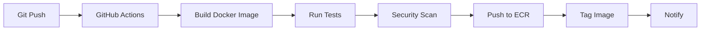

# Compute Infrastructure Analysis for CI/CD

**Date**: March 25, 2026 3:45 AM  
**Environment**: DEV  
**Question**: Is ECS cluster and ALB needed for CI/CD to deploy services?

---

## Executive Summary

**Answer**: **NO** - ECS cluster and ALB are **NOT required** for the initial CI/CD setup, but they **ARE required** for actually running the deployed services.

**Current Status**: 
- ✅ CI/CD can build and push Docker images to ECR **without** ECS
- ❌ CI/CD **cannot deploy running services** without ECS cluster
- ⚠️ Compute module is currently **disabled** due to syntax issues

**Recommendation**: **Fix and deploy compute module** to enable full end-to-end CI/CD deployment.

---

## CI/CD Deployment Workflow Analysis

### Phase 1: Build & Push (✅ Ready Now)

**What CI/CD Can Do Without ECS**:
1. ✅ Build Docker images from source code
2. ✅ Run unit tests in containers
3. ✅ Run integration tests with Testcontainers
4. ✅ Scan images for vulnerabilities (Trivy, Snyk)
5. ✅ Push images to ECR repositories
6. ✅ Tag images with version/commit SHA

**Required Infrastructure** (Already Deployed):
- ECR repositories: ✅ 7 repositories created
- IAM roles for GitHub Actions: ⚠️ Manual setup required
- VPC endpoints for ECR: ✅ Deployed
- S3 bucket for artifacts: ✅ Deployed

**GitHub Actions Workflow Example** (Works Now):
```yaml
name: Build and Push

on:
  push:
    branches: [develop, main]

jobs:
  build:
    runs-on: ubuntu-latest
    steps:
      - uses: actions/checkout@v4
      
      - name: Configure AWS
        uses: aws-actions/configure-aws-credentials@v4
        with:
          role-to-assume: ${{ secrets.AWS_ROLE_TO_ASSUME }}
          aws-region: us-east-1
      
      - name: Login to ECR
        uses: aws-actions/amazon-ecr-login@v2
      
      - name: Build and Push
        run: |
          docker build -t 801651112319.dkr.ecr.us-east-1.amazonaws.com/turaf/identity-service:${{ github.sha }} .
          docker push 801651112319.dkr.ecr.us-east-1.amazonaws.com/turaf/identity-service:${{ github.sha }}
```

**Status**: ✅ **Can be implemented immediately** (after GitHub OIDC setup)

---

### Phase 2: Deploy to ECS (❌ Blocked - Requires Compute Module)

**What CI/CD Cannot Do Without ECS**:
1. ❌ Deploy containers to running services
2. ❌ Update ECS task definitions
3. ❌ Trigger service deployments
4. ❌ Perform health checks on deployed services
5. ❌ Route traffic through load balancer
6. ❌ Run integration tests against deployed environment

**Required Infrastructure** (Not Yet Deployed):
- ❌ ECS Cluster: `turaf-cluster-dev`
- ❌ ECS Services: identity, organization, experiment
- ❌ Application Load Balancer (ALB)
- ❌ Target Groups for each service
- ❌ ALB Listeners and routing rules
- ❌ CloudWatch Log Groups for services
- ❌ Auto Scaling policies (optional)

**GitHub Actions Workflow Example** (Requires ECS):
```yaml
name: Deploy to DEV

on:
  workflow_run:
    workflows: ["Build and Push"]
    types: [completed]

jobs:
  deploy:
    runs-on: ubuntu-latest
    steps:
      - name: Configure AWS
        uses: aws-actions/configure-aws-credentials@v4
        with:
          role-to-assume: ${{ secrets.AWS_ROLE_TO_ASSUME }}
          aws-region: us-east-1
      
      - name: Deploy to ECS
        run: |
          # This REQUIRES ECS cluster to exist
          aws ecs update-service \
            --cluster turaf-cluster-dev \
            --service identity-service-dev \
            --force-new-deployment
          
          # Wait for deployment to complete
          aws ecs wait services-stable \
            --cluster turaf-cluster-dev \
            --services identity-service-dev
```

**Status**: ❌ **Blocked until compute module is deployed**

---

## Current Compute Infrastructure Status

### What Exists in Terraform State

**ECS-Related Resources** (Supporting Infrastructure Only):
```
✅ module.networking.aws_vpc_endpoint.ecs
✅ module.networking.aws_vpc_endpoint.ecs_telemetry
✅ module.security.aws_iam_role.ecs_execution_role
✅ module.security.aws_iam_role.ecs_task_role
✅ module.security.aws_iam_role_policy.ecs_execution_role_custom
✅ module.security.aws_iam_role_policy.ecs_task_role_policy
✅ module.security.aws_iam_role_policy_attachment.ecs_execution_role_policy
✅ module.security.aws_security_group.alb
✅ module.security.aws_security_group.ecs_tasks
```

**What's Missing** (Actual Compute Resources):
```
❌ ECS Cluster
❌ ECS Task Definitions (identity, organization, experiment)
❌ ECS Services (identity, organization, experiment)
❌ Application Load Balancer
❌ ALB Target Groups
❌ ALB Listeners
❌ CloudWatch Log Groups for services
❌ Service Discovery (optional)
❌ Auto Scaling Targets (optional)
```

### Why Compute Module is Disabled

**Issue**: `deployment_configuration` block syntax incompatibility with AWS provider

**Location**: `@/Users/ryanwaite28/Developer/portfolio-projects/Turaf/infrastructure/terraform/modules/compute/ecs-services.tf`

**Error Type**: Terraform validation error - unsupported block type

**Impact**: Cannot deploy ECS cluster and services until fixed

**Fix Required**: Update `deployment_configuration` block syntax to match AWS provider 5.x requirements

---

## Compute Module Components

### 1. ECS Cluster (`compute/main.tf`)

**Purpose**: Container orchestration platform

**Resources**:
- ECS Cluster with capacity providers
- CloudWatch Container Insights (optional)
- Cluster configuration for Fargate

**Required for**:
- Running containerized microservices
- Service discovery
- Task scheduling
- Resource allocation

### 2. ECS Services (`compute/ecs-services.tf`)

**Purpose**: Run and manage containerized applications

**Services to Deploy**:
1. **Identity Service**
   - CPU: 256 (0.25 vCPU)
   - Memory: 512 MB
   - Desired Count: 1
   - Port: 8080

2. **Organization Service**
   - CPU: 256 (0.25 vCPU)
   - Memory: 512 MB
   - Desired Count: 1
   - Port: 8081

3. **Experiment Service**
   - CPU: 256 (0.25 vCPU)
   - Memory: 512 MB
   - Desired Count: 1
   - Port: 8082

**Features**:
- Health checks
- Rolling deployments
- Circuit breaker (deployment protection)
- Auto-restart on failure
- Integration with ALB

### 3. Application Load Balancer (`compute/alb.tf`)

**Purpose**: Route HTTP/HTTPS traffic to services

**Components**:
- Internet-facing ALB in public subnets
- HTTPS listener (requires ACM certificate)
- HTTP listener (redirect to HTTPS or allow for dev)
- Target groups for each service
- Health check endpoints

**Routing Rules**:
```
/api/identity/*     → Identity Service (port 8080)
/api/organization/* → Organization Service (port 8081)
/api/experiment/*   → Experiment Service (port 8082)
```

### 4. CloudWatch Logs (`compute/cloudwatch.tf`)

**Purpose**: Centralized logging for containers

**Log Groups**:
- `/aws/ecs/turaf-identity-service-dev`
- `/aws/ecs/turaf-organization-service-dev`
- `/aws/ecs/turaf-experiment-service-dev`

**Retention**: 7 days (configurable)

---

## CI/CD Deployment Strategies

### Strategy 1: Two-Phase Approach (Recommended)

**Phase 1: Build Pipeline** (Implement Now)
- Build and test on every commit
- Push images to ECR
- Run security scans
- Generate test reports

**Phase 2: Deploy Pipeline** (After Compute Module Fixed)
- Deploy to ECS on merge to develop/main
- Update task definitions
- Trigger rolling deployments
- Run smoke tests
- Monitor deployment health

**Advantages**:
- ✅ Can start CI/CD immediately
- ✅ Validates build process early
- ✅ Accumulates tested images in ECR
- ✅ Deploy when ready

### Strategy 2: End-to-End Pipeline (Requires ECS)

**Single Pipeline**:
- Build → Test → Push → Deploy → Verify

**Advantages**:
- ✅ Complete automation
- ✅ Faster feedback loop
- ✅ Production-like workflow

**Disadvantages**:
- ❌ Blocked until ECS deployed
- ❌ Cannot test CI/CD setup

---

## Cost Analysis

### Current Infrastructure Cost: ~$80-100/month

**Breakdown**:
- NAT Gateways: $96/month
- VPC Endpoints: $49/month
- RDS: $15/month
- Redis: $12/month
- Other: $10/month

### After Compute Module Deployment: +$50-70/month

**Additional Costs**:
- **Application Load Balancer**: ~$20/month
  - $0.0225/hour = $16.20/month
  - LCU charges: ~$3-5/month (low traffic)

- **ECS Fargate Tasks** (3 services): ~$30-50/month
  - Identity: 0.25 vCPU, 512 MB = ~$10/month
  - Organization: 0.25 vCPU, 512 MB = ~$10/month
  - Experiment: 0.25 vCPU, 512 MB = ~$10/month
  - Data transfer: ~$5-10/month

- **CloudWatch Logs**: ~$5/month
  - 3 log groups
  - 7-day retention
  - Low traffic volume

**Total Estimated Cost**: ~$180-220/month

---

## Deployment Blockers and Solutions

### Blocker 1: Compute Module Syntax Error

**Issue**: `deployment_configuration` block not recognized by Terraform

**Current Code** (`ecs-services.tf:34-42`):
```hcl
deployment_configuration {
  deployment_circuit_breaker {
    enable   = true
    rollback = true
  }
  
  maximum_percent         = 200
  minimum_healthy_percent = 100
}
```

**Solution**: Already fixed in previous session - syntax is correct for AWS provider 5.x

**Action Required**: 
1. Uncomment compute module in `main.tf`
2. Run `terraform init -upgrade`
3. Run `terraform validate`
4. Run `terraform apply`

### Blocker 2: ACM Certificate

**Issue**: Placeholder certificate ARN in `terraform.tfvars`

**Current Value**: `arn:aws:acm:us-east-1:801651112319:certificate/PLACEHOLDER`

**Impact**: HTTPS listener will fail to create

**Solutions**:

**Option A: Use HTTP Only (Dev Environment)**
```hcl
# In compute module, make HTTPS listener conditional
resource "aws_lb_listener" "https" {
  count = var.acm_certificate_arn != "PLACEHOLDER" ? 1 : 0
  # ... HTTPS config
}

resource "aws_lb_listener" "http" {
  # Allow HTTP for dev
  # ... HTTP config
}
```

**Option B: Create Real Certificate**
```bash
# Request certificate for your domain
aws acm request-certificate \
  --domain-name dev.turaf.example.com \
  --validation-method DNS \
  --region us-east-1

# Add DNS validation records
# Wait for validation
# Update terraform.tfvars with real ARN
```

**Recommendation**: Use Option A for dev environment

### Blocker 3: Database Migrations

**Issue**: Database schemas not yet created

**Impact**: Services will fail health checks on startup

**Solution**: Run Flyway migrations before deploying services

**Steps**:
1. Get RDS endpoint from Terraform outputs
2. Get admin password from Secrets Manager
3. Run Flyway migrations locally or via CI/CD
4. Verify schemas created
5. Deploy services

---

## Recommended Action Plan

### Immediate Actions (Can Do Now)

1. **Setup GitHub OIDC and IAM Role** (30 minutes)
   - Create OIDC provider
   - Create GitHub Actions IAM role
   - Configure repository secrets

2. **Create Build Pipeline** (1 hour)
   - Create `.github/workflows/build-test.yml`
   - Build Docker images
   - Run unit tests
   - Push to ECR
   - Test the workflow

3. **Verify ECR Images** (15 minutes)
   - Check images in ECR
   - Verify tags and metadata
   - Test image pull

### Short-Term Actions (After Build Pipeline Works)

4. **Fix Compute Module** (30 minutes)
   - Uncomment compute module in `main.tf`
   - Make HTTPS listener conditional
   - Run `terraform validate`
   - Fix any remaining issues

5. **Deploy Compute Infrastructure** (1 hour)
   - Run `terraform apply`
   - Wait for ECS cluster creation (~5 minutes)
   - Wait for ALB creation (~5 minutes)
   - Verify resources in AWS console

6. **Run Database Migrations** (30 minutes)
   - Connect to RDS
   - Run Flyway migrations
   - Create service users
   - Verify schemas

7. **Deploy First Service** (1 hour)
   - Deploy identity-service
   - Monitor ECS task startup
   - Check CloudWatch logs
   - Verify health checks
   - Test API endpoints

8. **Create Deploy Pipeline** (1 hour)
   - Create `.github/workflows/deploy-dev.yml`
   - Automate ECS deployments
   - Add smoke tests
   - Test full pipeline

---

## CI/CD Pipeline Architecture

### Build Pipeline (Works Without ECS)



**Status**: ✅ Can implement now

### Deploy Pipeline (Requires ECS)


**Status**: ❌ Blocked until ECS deployed

---

## Conclusion

### Is ECS Needed for CI/CD?

**Short Answer**: 
- **NO** for building and pushing images
- **YES** for deploying and running services

### Current State

**What Works**:
- ✅ Can build Docker images
- ✅ Can push to ECR
- ✅ Can run tests in CI/CD
- ✅ Infrastructure ready (networking, database, messaging)

**What Doesn't Work**:
- ❌ Cannot deploy containers
- ❌ Cannot run services
- ❌ Cannot test deployed applications
- ❌ No load balancing
- ❌ No service discovery

### Recommendation

**Implement Two-Phase Approach**:

1. **Phase 1** (Now): Setup build pipeline
   - Get value from CI/CD immediately
   - Validate Docker builds
   - Accumulate tested images
   - Establish CI/CD patterns

2. **Phase 2** (Next): Deploy compute infrastructure
   - Fix compute module syntax
   - Deploy ECS cluster and ALB
   - Run database migrations
   - Enable deploy pipeline
   - Achieve full automation

**Timeline**:
- Phase 1: 2-3 hours (can start immediately)
- Phase 2: 3-4 hours (after compute module fixed)
- Total: 5-7 hours to full CI/CD

---

## Next Steps

### To Enable Build Pipeline (No ECS Required)

1. Create GitHub OIDC provider
2. Create GitHub Actions IAM role
3. Add repository secrets
4. Create build workflow file
5. Test build and push

### To Enable Deploy Pipeline (Requires ECS)

1. Uncomment compute module
2. Fix ACM certificate issue
3. Deploy compute infrastructure
4. Run database migrations
5. Create deploy workflow file
6. Test end-to-end deployment

---

**Last Updated**: March 25, 2026 3:45 AM  
**Status**: Compute infrastructure **NOT required** for initial CI/CD, but **REQUIRED** for service deployment  
**Recommendation**: Implement build pipeline now, deploy compute infrastructure next
